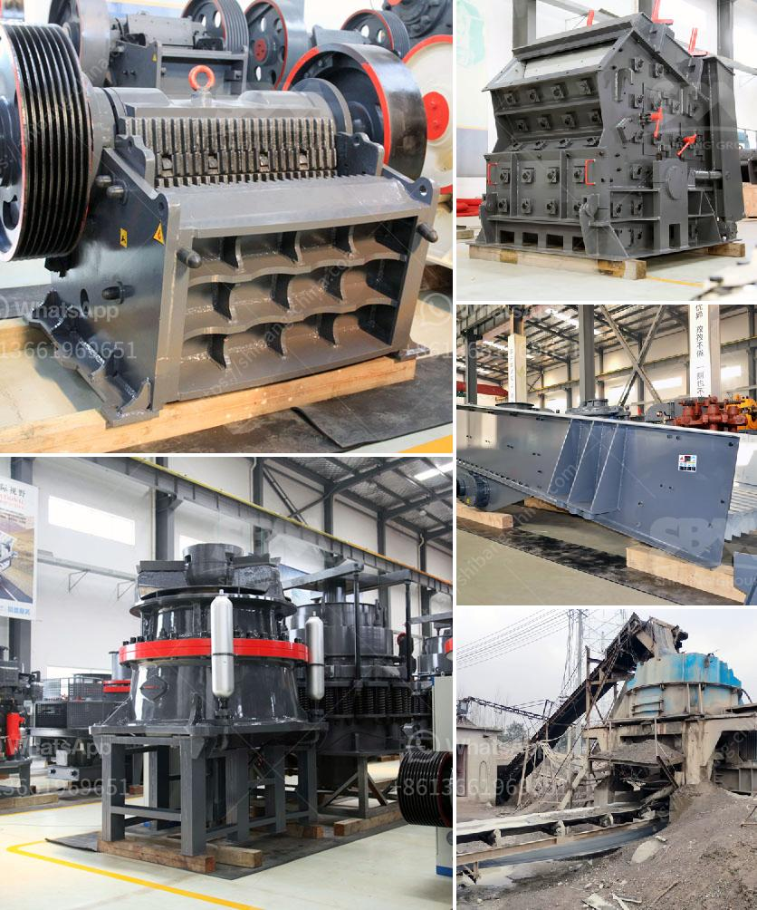

<h3>gypsum processing plant in</h3>
Gypsum is a versatile and non-toxic mineral used widely in various industries. It is mainly used for making wall and ceiling materials, plaster of Paris, as well as for soil conditioning and fertilizer. Gypsum processing plants differ widely in scale and level of technology. They range from plants producing one or two tonnes per day using low-cost manual technologies, to plants of a thousand tonnes per day employing high-end automated technologies.

The gypsum ore is mined in a gypsum quarry, which consists of underground mines and open pits. The ore is initially crushed, screened, and then transported to the processing plant. Gypsum ore is processed into various grades, including ultra-pure, food-grade, and industrial-grade gypsum.

There are several processing techniques used in gypsum processing plants. The most common methods include crushing, grinding, calcination, and dewatering.

The first step is crushing gypsum ore into smaller particles suitable for further processing. This is usually done using a jaw crusher or impact crusher. The crushed gypsum is then screened into different size fractions.

Next, the gypsum is ground to a fine powder in a ball mill or vertical roller mill. The powdered gypsum is then heated in a calciner to drive off excess water and convert it into its final form, known as plaster of Paris.

Dewatering is an important step to remove excess water from the gypsum slurry. This is usually done using a filter press or centrifuge. The dewatered gypsum is then dried in a rotary dryer or a flash dryer to remove residual moisture.

Gypsum processing plants have made significant progress in reducing their environmental footprint. Many plants now incorporate pollution control equipment such as scrubbers, baghouses, and electrostatic precipitators to capture particulate emissions. Additionally, water is often recycled within the plant, reducing the need for freshwater consumption.

In areas where gypsum processing plants operate, there may be concerns regarding the disposal of gypsum waste. Efforts are being made to find innovative ways to utilize gypsum waste, such as in construction materials or as a soil amendment.

Gypsum processing plants provide numerous economic benefits to local communities. They create employment opportunities, both directly at the plant and indirectly through related industries such as transportation and construction. The industry also contributes to tax revenue, which can be used for infrastructure development and other public services.

Furthermore, the presence of a gypsum processing plant can attract other industries to the area. For example, manufacturers of gypsum boards, wall panels, and other construction materials may choose to locate their operations nearby to reduce transportation costs.

Gypsum processing plants play a crucial role in the production of gypsum-based materials used in construction, agriculture, and various other industries. These plants employ different processing techniques to produce high-quality gypsum products while minimizing environmental impacts. Additionally, they provide significant economic benefits to local communities. With ongoing efforts to improve technology and find innovative uses for gypsum waste, the industry is well-positioned for sustainable growth in the future.
<h3>Contact us</h3><ul><li><strong>Whatsapp:&nbsp;<a href="https://wa.me/8613661969651">+8613661969651</a></strong></li><li><a href="https://swt.shibang-china.com/?git&amp;zhl&amp;gypsum processing plant in"><strong>Online Service(chat now)</strong></a></li></ul><h3>Related</h3><ul><li><a href='list of equipments for a quarry crusher.md'>list of equipments for a quarry crusher</a></li><li><a href='gyratory cone crusher.md'>gyratory cone crusher</a></li><li><a href='gold mill for sale in zimbabwe.md'>gold mill for sale in zimbabwe</a></li><li><a href='crusher for quartz.md'>crusher for quartz</a></li><li><a href='business plan for small scale chrome mining.md'>business plan for small scale chrome mining</a></li></ul>