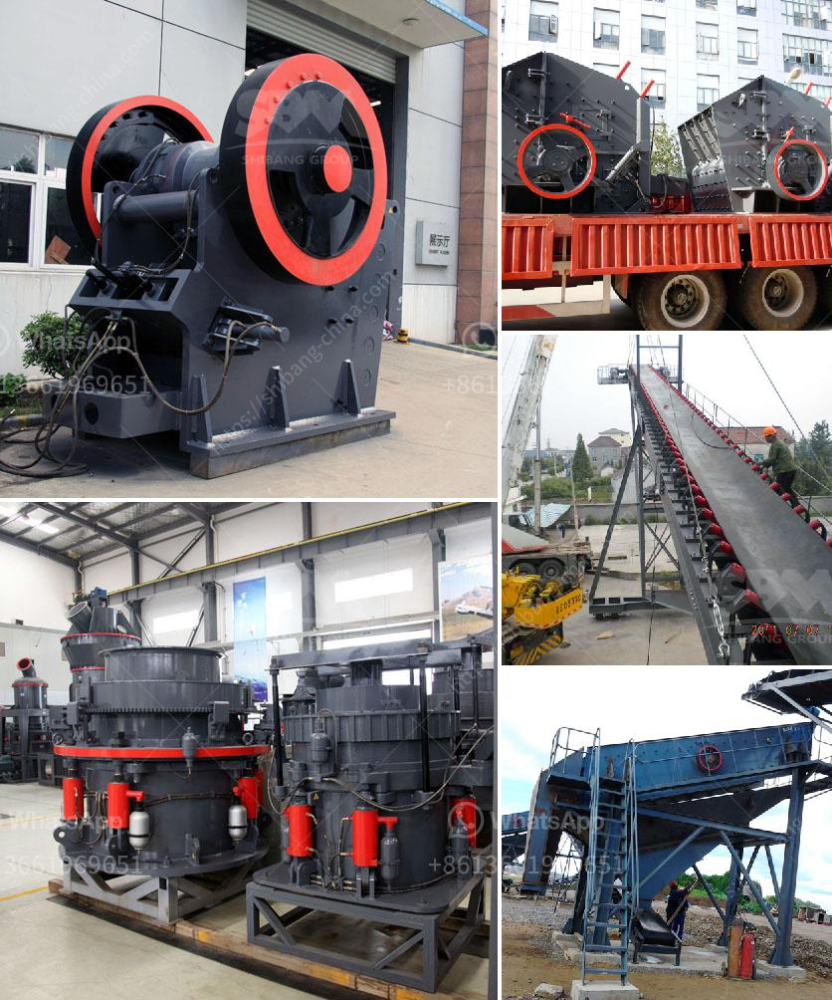

<h3>gyratory cone crusher</h3>
The gyratory cone crusher is a newly developed hydraulic cone crusher by Henan Xinhai Machinery Co., Ltd. It combines the advantages of both the gyratory and jaw crusher, which has the characteristics of high crushing capacity, high production efficiency, easy adjustment, and good granularity shape.

1. Big capacity and high efficiency: Using a large crushing chamber and a high-speed crushing action, the gyratory cone crusher can process more materials at a time, which greatly improves the processing capacity of the equipment. The combination of optimized cavity design and reasonable stroke ensures a higher production efficiency.

2. Easy adjustment and good granularity shape: The gyratory cone crusher is equipped with a hydraulic adjustment device, which enables the operator to conveniently adjust the discharge opening and control the size of the final product. Additionally, the crushing chamber is specially designed to ensure a good particle shape of the crushed product.

3. Low operating cost: The gyratory cone crusher has a long service life and requires low maintenance, reducing the downtime and increasing the operational efficiency. The unique design of the crushing chamber reduces the wear and tear of the equipment, extending its service life and reducing the cost of equipment maintenance.

4. Wide range of applications: The gyratory cone crusher is suitable for various hardness rocks, ranging from limestone to basalt. It can crush materials in middle and high hardness such as iron ore, copper ore, granite, basalt, cobblestone, marble, and limestone.

In conclusion, the gyratory cone crusher is a modern and high-efficient crushing machine that provides numerous benefits to its users. With its large capacity, high efficiency, and easy adjustment, it is an ideal choice for crushing various materials in the mining, construction, road building, and chemical industries.
<h3>Contact us</h3><ul><li><strong>Whatsapp:&nbsp;<a href="https://wa.me/8613661969651">+8613661969651</a></strong></li><li><a href="https://swt.shibang-china.com/?git&amp;zhl&amp;gyratory cone crusher"><strong>Online Service(chat now)</strong></a></li></ul><h3>Related</h3><ul><li><a href='jaw crusher 0 5 t 1ton per hour.md'>jaw crusher 0 5 t 1ton per hour</a></li><li><a href='copper slag crusher machine manufacturer india.md'>copper slag crusher machine manufacturer india</a></li><li><a href='ball mills for grinding.md'>ball mills for grinding</a></li><li><a href='kenya crusher supplier.md'>kenya crusher supplier</a></li><li><a href='what is the cost of crusher.md'>what is the cost of crusher</a></li></ul>