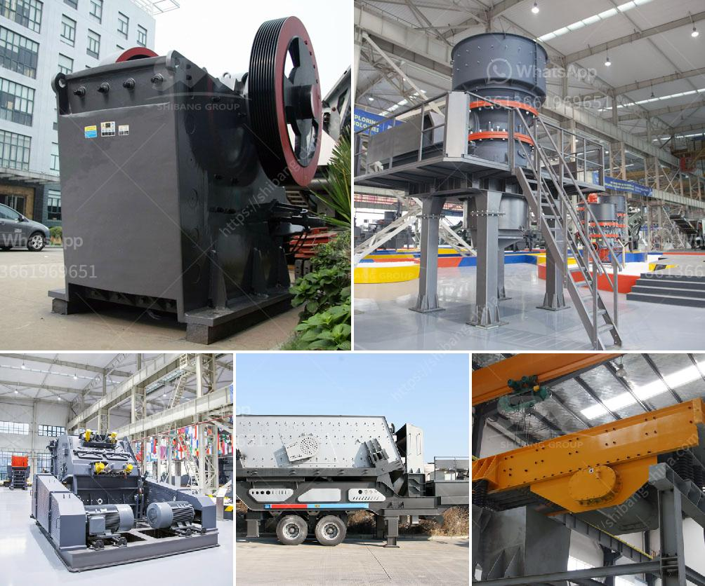

<h3>hammer crusher kapasitas 10 ton per jam dan ukurannya</h3>
A hammer crusher is a machine that utilizes a steel hammer to crush material. All-electric hammer crushers use motors to drive the hammers. The rotating speed and material feed rate are both vital factors in its operation. The hammer crusher's capacity is measured in units of tons per hour (tons/hour). In this case, we will be focusing on the capacity of the hammer crusher, which is 10 tons per jam.

The size of the hammer crusher is another crucial aspect to consider. A crusher's size determines the amount of material it can process at any given time. Additionally, it impacts the uniformity and fineness of the final product. In this scenario, the hammer crusher kapasitas is classified as having a capacity of 10 tons per jam. In terms of its size, it is necessary to examine its dimensions to gain a better understanding of its physical characteristics.

A standard hammer crusher typically measures around 2000 x 1500 millimeters or approximately 2 x 1.5 meters. This size ensures that the crusher has sufficient space to accommodate large quantities of material. The feed opening of the crusher usually ranges between 300 x 300 millimeters to 900 x 900 millimeters. These dimensions provide ample space for the material to enter the crushing chamber.

Moreover, the weight of the hammer crusher is also an important consideration. The weight of the machine affects its stability during operation. A standard hammer crusher, with a capacity of 10 tons per jam, typically weighs around 6 tons. This weight allows for efficient crushing and ensures that the machine remains stable during use.

The hammer crusher operates by rotating the hammers at a high speed to impact the material. The hammers are attached to a rotor that spins rapidly, creating the crushing force. As the material enters the crushing chamber, it is struck by the rotating hammers, breaking it into smaller pieces. The crushed material then exits through the grate openings at the bottom of the machine.

Additionally, the size of the grate openings in the hammer crusher also impacts the final product size and shape. The grate openings determine the amount of material that can pass through them. By adjusting the grate opening size, operators can control the final product's size and ensure uniformity.

In conclusion, the hammer crusher with a kapasitas of 10 tons per jam and its size are crucial factors in determining its efficiency and performance. The size of the machine, including its dimensions and weight, plays a significant role in its ability to process large quantities of material. Additionally, the size of the grate openings determines the final product's size and shape. Understanding these characteristics is essential for choosing the right hammer crusher for various crushing applications.
<h3>Contact us</h3><ul><li><strong>Whatsapp:&nbsp;<a href="https://wa.me/8613661969651">+8613661969651</a></strong></li><li><a href="https://swt.shibang-china.com/?git&amp;zhl&amp;hammer crusher kapasitas 10 ton per jam dan ukurannya"><strong>Online Service(chat now)</strong></a></li></ul><h3>Related</h3><ul><li><a href='operation of stone crusher and screening.md'>operation of stone crusher and screening</a></li><li><a href='size ball mills for miner.md'>size ball mills for miner</a></li><li><a href='quarry business in nigeria.md'>quarry business in nigeria</a></li><li><a href='providers conveyor belts in mexico.md'>providers conveyor belts in mexico</a></li><li><a href='ghana quarry crusher.md'>ghana quarry crusher</a></li></ul>