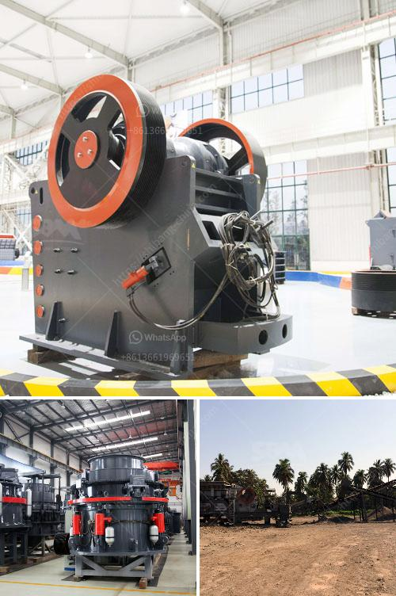

<h3>hammer crusher mill</h3>
Every year, the construction industry witnesses a surge in the demand for various raw materials such as stones, gravels, aggregates, and concrete products. These materials are vital for building roads, bridges, houses, and other infrastructure projects. One key equipment that contributes to the successful completion of these projects is a hammer crusher mill.

A hammer crusher mill is a machine that uses a high-speed rotating hammerhead to collide and crush materials. It can effectively process both brittle and soft materials, ensuring the finished product has excellent particle size and high crushing efficiency. The mill comes with various sizes of hammerheads to meet different production requirements.

One of the significant advantages of a hammer crusher mill is its versatility. It can handle a wide range of materials, including limestone, coal, gypsum, glass, and other industrial minerals. This versatility makes it suitable for various industries such as mining, cement, chemical, and metallurgy. It can also be used in recycling operations to crush concrete and asphalt waste.

The robust construction of a hammer crusher mill ensures its durability and long-term performance. It is built with heavy-duty materials that can withstand the impact of the materials being crushed. The mill is also designed with replaceable wear parts to minimize maintenance costs and downtime.

Operating a hammer crusher mill is relatively simple. The materials are fed into the crushing chamber through a hopper, and the rotating hammerheads hit and crush them against the chamber's walls. The crushed materials are then discharged through a screen or a perforated plate.

To ensure safe operation, modern hammer crusher mills are equipped with advanced safety features. These may include an electronic control system to monitor and adjust the machine's settings, an emergency stop button, and automatic shut-off mechanisms in case of any abnormal operation.

In conclusion, a hammer crusher mill is an essential machine in various industries for crushing and processing a wide range of materials. Its versatility, robust construction, and ease of operation make it a reliable and efficient crushing solution. Whether for construction, mining, or recycling purposes, a hammer crusher mill is an excellent choice for your crushing needs.
<h3>Contact us</h3><ul><li><strong>Whatsapp:&nbsp;<a href="https://wa.me/8613661969651">+8613661969651</a></strong></li><li><a href="https://swt.shibang-china.com/?git&amp;zhl&amp;hammer crusher mill"><strong>Online Service(chat now)</strong></a></li></ul><h3>Related</h3><ul><li><a href='ball mill 20 ton.md'>ball mill 20 ton</a></li><li><a href='mill price for minerals in bolivia.md'>mill price for minerals in bolivia</a></li><li><a href='coconut shell powder machine project report.md'>coconut shell powder machine project report</a></li><li><a href='double roll crusher indonesia.md'>double roll crusher indonesia</a></li><li><a href='artificial sand making in karnataka.md'>artificial sand making in karnataka</a></li></ul>