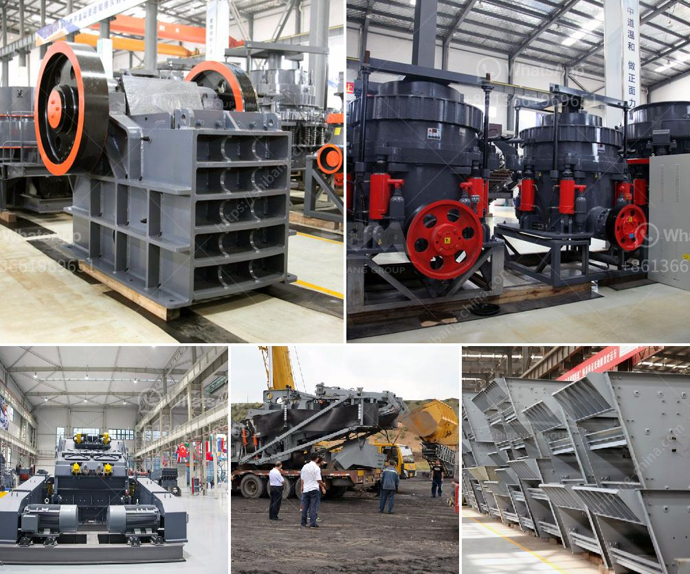

<h3>hammer mill dimensions</h3>
A hammer mill is a piece of equipment used for grinding and pulverizing materials to be used for different purposes. The main purpose of a hammer mill is to transform solid material into smaller pieces by crushing it with the repeated blows of hammers. The size of these small pieces depends on the size of the openings in the hammer mill screens.

One crucial factor to consider in a hammer mill is dimensional specifications. The dimensions of a hammer mill determine the capacity and efficiency of the equipment, as well as the finished particle size produced. Let's take a closer look at why the dimensions of a hammer mill matter.

Firstly, the dimensions of a hammer mill impact its capacity and productivity. The larger the dimensions of the equipment, the greater its capacity to process materials. This is because it has a larger grinding chamber and can accommodate more material at once. Conversely, a smaller hammer mill will have a lower capacity since it can handle only a limited amount of material at a time. Therefore, it is essential to choose the right size hammer mill based on the anticipated workload.

Secondly, the dimensions of a hammer mill affect the efficiency of the grinding process. The grinding efficiency is influenced by factors such as the speed of rotation, the hammer's shape, and the hammer mill screen size. A larger hammer mill can generate higher tip speeds, which result in a more efficient grinding action. Additionally, a larger hammer mill provides more space for the hammers to hit and pulverize the material, leading to better grinding performance.

Thirdly, the dimensions of a hammer mill impact the final particle size achieved. The size of the openings in the hammer mill screens determines the size of the particles produced after grinding. Smaller screen openings allow for finer particles, while larger screen openings result in coarser particles. Thus, by choosing the appropriate dimensions for a hammer mill, one can achieve the desired particle size for their specific application.

Moreover, the dimensions of a hammer mill also impact its installation and operation. The physical size of the equipment is a crucial consideration when determining its placement within a facility or a production line. A compact hammer mill might be more suitable for limited spaces or mobile operations, while a larger hammer mill may require a dedicated area. It is imperative to ensure that the dimensions of the mill align with the available space and the operational requirements.

In conclusion, the dimensions of a hammer mill play a fundamental role in determining its capacity, efficiency, and the size of the particles produced. It is essential to carefully consider these factors when choosing a hammer mill for a specific application. By selecting the proper dimensions, one can maximize the productivity and output of the grinding process while achieving the desired final particle size. Remember, getting the right size hammer mill can greatly impact the overall success and efficiency of your processing operation.
<h3>Contact us</h3><ul><li><strong>Whatsapp:&nbsp;<a href="https://wa.me/8613661969651">+8613661969651</a></strong></li><li><a href="https://swt.shibang-china.com/?git&amp;zhl&amp;hammer mill dimensions"><strong>Online Service(chat now)</strong></a></li></ul><h3>Related</h3><ul><li><a href='quartz processing machine up to 300 mesh.md'>quartz processing machine up to 300 mesh</a></li><li><a href='concrete stones crushing business plan.md'>concrete stones crushing business plan</a></li><li><a href='kenya hammer mill is manufactured.md'>kenya hammer mill is manufactured</a></li><li><a href='aggregate crushing machines.md'>aggregate crushing machines</a></li><li><a href='roller mill corrugation.md'>roller mill corrugation</a></li></ul>