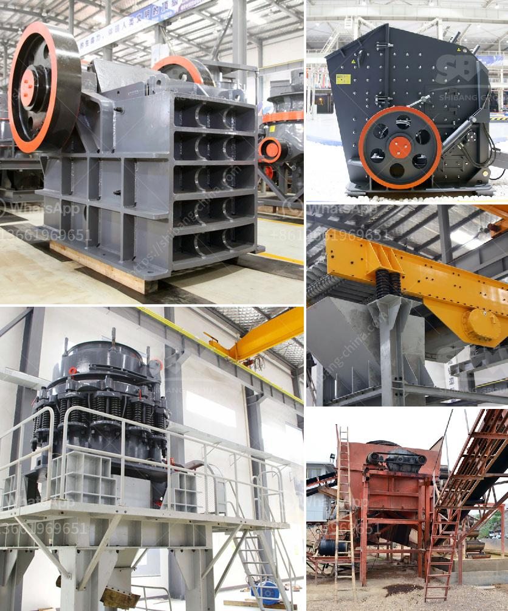

<h3>hammer mill for gold</h3>
A hammer mill for gold is a grinding machine used to shred or crush materials into smaller pieces. The basic design of this type of grinder involves a rotating shaft with free-swinging hammers, which reduce the material by impacting it against walls inside the grinding chamber.

The key benefit of a hammer mill for gold is its ability to process a wide range of materials, from gold ore to coal and limestone. It can crush and pulverize materials of various sizes and hardness levels, making it a versatile machine for any gold processing operation.

When it comes to gold processing, the hammer mill plays a crucial role in the initial size reduction of the ore. It is commonly used in small-scale mining operations to finely grind ore into a smaller particle size, allowing for easier extraction of gold. The finely ground gold-bearing ore is then mixed with water and other chemicals to create a slurry, which is fed into other processing equipment for further concentration and separation.

In addition to its gold processing capabilities, a hammer mill for gold can also be used in other industries such as construction, metallurgy, and agriculture. It can crush and grind various materials, including grains, herbs, and fibrous materials, making it a valuable tool for small-scale farmers and food processors.

With advancements in technology, modern hammer mills for gold are designed to be more efficient and productive. They are typically equipped with features such as adjustable speed controls, interchangeable screens, and automatic feeders. These features allow for greater control and customization, enabling operators to achieve the desired particle size and consistency.

In summary, a hammer mill for gold is a versatile and essential machine in the gold processing industry. Whether used for initial size reduction of gold ore or grinding various materials, it offers great performance and reliability. As the demand for gold continues to rise, the use of hammer mills for gold processing is expected to increase in the coming years.
<h3>Contact us</h3><ul><li><strong>Whatsapp:&nbsp;<a href="https://wa.me/8613661969651">+8613661969651</a></strong></li><li><a href="https://swt.shibang-china.com/?git&amp;zhl&amp;hammer mill for gold"><strong>Online Service(chat now)</strong></a></li></ul><h3>Related</h3><ul><li><a href='stone crusher plant layout pdf.md'>stone crusher plant layout pdf</a></li><li><a href='used crusher for sale in jamaica.md'>used crusher for sale in jamaica</a></li><li><a href='china best crusher manufacturers.md'>china best crusher manufacturers</a></li><li><a href='vertical roller mill animation gif.md'>vertical roller mill animation gif</a></li><li><a href='what is the cost of crusher.md'>what is the cost of crusher</a></li></ul>