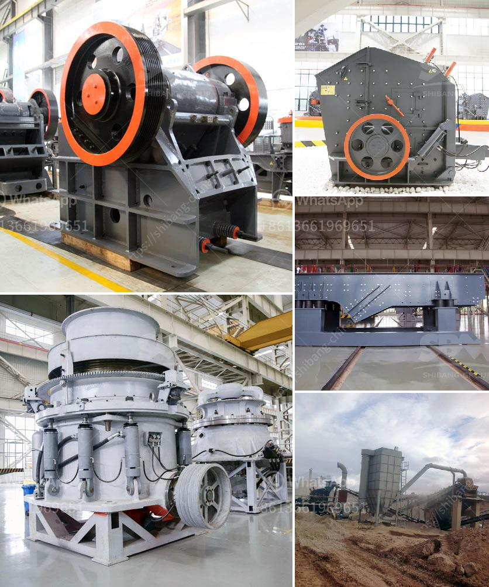

<h3>hammer mill for sale in south africa</h3>
The hammer mill for sale in South Africa is a versatile milling machine for industrial use. This powerful machine grinds down big particles into fine particles for processing materials in a variety of industries. The hammer mill for sale in South Africa is ideal for grinding grains, maize, corn, soybeans, wheat, millet, sorghum, rice, and other materials into powder form for livestock and poultry feed.

Hammer mills are renowned for their efficiency and versatility. They can be used in a wide range of applications, such as milling grains, providing livestock feed, crushing stones, processing biomass, and even recycling materials. The hammer mill's ability to finely grind, together with its low power consumption and minimal maintenance requirements, makes it a cost-effective investment for businesses of all sizes.

In South Africa, there are various suppliers and manufacturers of hammer mills for sale. The following are some top suppliers:

1. ABC Hansen Africa: This company sells a range of hammer mills suitable for small-scale operations to large commercial milling plants. They offer cost-effective solutions designed to cater to customer requirements.

2. Agricon: With over 20 years of experience, Agricon is a popular choice for hammer mills. Their machines are used in the biomass, animal feed, and recycling industries.

3. Staalmeester: Staalmeester manufactures and supplies high-quality agricultural equipment in South Africa. Their hammer mills are designed for optimal performance and reliability.

When purchasing a hammer mill in South Africa, it's essential to consider factors such as the required capacity, desired grind size, power source (electric or diesel), and maintenance requirements. Additionally, ensure that the supplier provides after-sales support, spare parts availability, and a warranty for the machine.

In conclusion, a hammer mill for sale in South Africa is a versatile and cost-effective milling machine that finds application in multiple industries. It is an investment that can enhance your business operations by reducing processing time and costs while producing high-quality products. Consider your specific requirements, research reputable suppliers, and choose a hammer mill that meets your needs for optimal results.
<h3>Contact us</h3><ul><li><strong>Whatsapp:&nbsp;<a href="https://wa.me/8613661969651">+8613661969651</a></strong></li><li><a href="https://swt.shibang-china.com/?git&amp;zhl&amp;hammer mill for sale in south africa"><strong>Online Service(chat now)</strong></a></li></ul><h3>Related</h3><ul><li><a href='used mobile crusher in uae.md'>used mobile crusher in uae</a></li><li><a href='gold processing equipment price in ghana.md'>gold processing equipment price in ghana</a></li><li><a href='gyratory cone crusher.md'>gyratory cone crusher</a></li><li><a href='plant and machinery of quartz for sale in india.md'>plant and machinery of quartz for sale in india</a></li><li><a href='screens hammer mills.md'>screens hammer mills</a></li></ul>