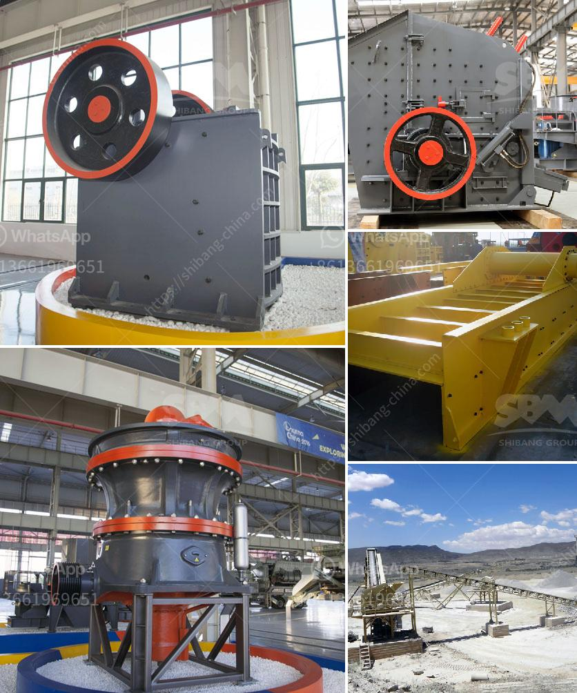

<h3>hammer mill furniture</h3>
Hammer mill furniture has revolutionized the world of interior design and home decor. With its unique and innovative construction technique, hammer mill furniture offers a sleek and contemporary look that is both stylish and functional. From coffee tables to bookshelves, this type of furniture is taking the industry by storm.

One of the key features of hammer mill furniture is the use of hammer mill wood. This type of wood is made by hammering small pieces of wood together, creating a strong and durable material that is resistant to wear and tear. This unique construction technique not only adds strength to the furniture but also gives it a distinct and eye-catching appearance.

Another advantage of hammer mill furniture is its versatility. The strong and sturdy nature of the hammer mill wood allows for the creation of various designs and shapes. From clean and minimalist lines to intricate and artistic patterns, this type of furniture can easily adapt to any style and preference.

Moreover, hammer mill furniture is also environmentally friendly. By using small pieces of wood and recycling waste wood, this furniture helps reduce waste and contributes towards a more sustainable lifestyle. Additionally, the durability of hammer mill wood ensures that the furniture will last for years, eliminating the need for frequent replacements and further reducing the environmental impact.

The popularity of hammer mill furniture can be attributed to its ability to combine functionality with aesthetics. The sturdy construction and durability make it suitable for everyday use, while the unique and artistic designs add a touch of sophistication to any space. Whether you are furnishing your living room, bedroom, or even office, hammer mill furniture offers a modern and elegant solution that will truly make a statement.

In conclusion, hammer mill furniture has emerged as a game-changer in the world of home decor. Its unique construction technique using hammer mill wood provides strength, durability, and visually appealing designs. This furniture not only enhances the aesthetics of any space but also contributes towards a more sustainable and eco-friendly lifestyle. For those looking to add a touch of innovation and style to their homes, hammer mill furniture is definitely worth considering.
<h3>Contact us</h3><ul><li><strong>Whatsapp:&nbsp;<a href="https://wa.me/8613661969651">+8613661969651</a></strong></li><li><a href="https://swt.shibang-china.com/?git&amp;zhl&amp;hammer mill furniture"><strong>Online Service(chat now)</strong></a></li></ul><h3>Related</h3><ul><li><a href='raymond mill bentonite.md'>raymond mill bentonite</a></li><li><a href='model pe 250 400 bantalan jaw crusher.md'>model pe 250 400 bantalan jaw crusher</a></li><li><a href='hammer mills grinding.md'>hammer mills grinding</a></li><li><a href='ball mills for calcium.md'>ball mills for calcium</a></li><li><a href='used stone crushers in south africa in zambia.md'>used stone crushers in south africa in zambia</a></li></ul>