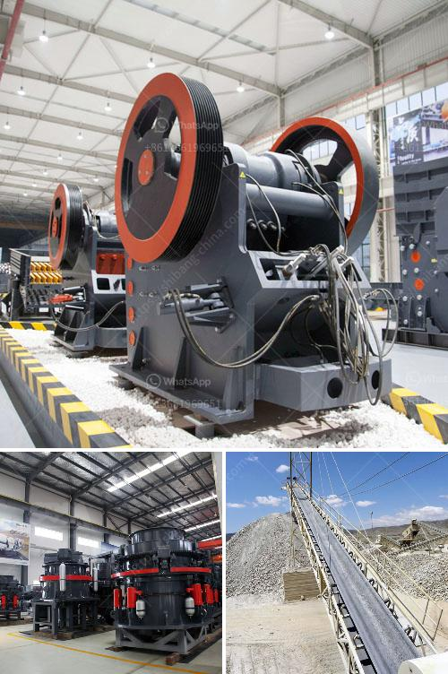

<h3>hammer mill lima price</h3>
The Lima hammer mill is specially designed to meet the needs of small farmers in South America. The mill not only provides farmers with the necessary tools to grind their own grains but also allows them to sell their freshly ground products to local markets. The Lima hammer mill is a perfect example of a simple yet practical solution for agricultural entrepreneurs.

One of the main advantages of the Lima hammer mill is its price. This machine is incredibly affordable, making it accessible to a wide range of small-scale farmers. Unlike other machinery in the market, the Lima hammer mill does not require a large financial investment. It is specifically built to cater to the needs of low-budget farmers who are looking to increase their productivity without breaking the bank.

The Lima hammer mill is also well-known for its durability. The machine is made with high-quality materials, ensuring that it can withstand the harsh conditions of a farm. This durability is a critical factor for farmers, as they need equipment that can last for years without requiring constant repairs or replacement. The Lima hammer mill is known to be long-lasting, making it a reliable choice for farmers who are looking for machinery that can stand the test of time.

Additionally, the Lima hammer mill offers ease of use. It has a user-friendly interface that allows farmers with little technical knowledge to operate it effectively. The machine is straightforward to assemble, and its functions are clearly labeled, making it accessible to farmers of all skill levels. This simplicity is vital for small-scale farmers who often do not have access to specialized training or technical support.

Another essential aspect of the Lima hammer mill is its versatility. It can grind various types of grains, including corn, wheat, and rice, allowing farmers to diversify their products. This versatility is crucial for farmers who want to explore different markets and cater to various consumer preferences. The Lima hammer mill enables farmers to produce a wide range of products, from fine flour to coarse meal, providing them with options to meet the demands of their target markets.

Moreover, the Lima hammer mill has a compact design, making it suitable for small spaces. This is a significant advantage for farmers who often have limited workshop areas. The small footprint of the Lima hammer mill allows farmers to optimize their farm layout and use their space efficiently.

In conclusion, the Lima hammer mill is an excellent investment for small-scale farmers in South America. Its affordable price, durability, ease of use, versatility, and compact design make it a valuable asset for agricultural entrepreneurs. By grinding their own grains, farmers can increase their productivity and profit margins while providing freshly ground products to local markets. The Lima hammer mill is a commendable example of a practical solution that meets the specific needs of small-scale farmers.
<h3>Contact us</h3><ul><li><strong>Whatsapp:&nbsp;<a href="https://wa.me/8613661969651">+8613661969651</a></strong></li><li><a href="https://swt.shibang-china.com/?git&amp;zhl&amp;hammer mill lima price"><strong>Online Service(chat now)</strong></a></li></ul><h3>Related</h3><ul><li><a href='copper slag crusher machine manufacturer india.md'>copper slag crusher machine manufacturer india</a></li><li><a href='10tph mobile stone crusher with vibrating screen.md'>10tph mobile stone crusher with vibrating screen</a></li><li><a href='used mobile jaw crusher dealers in ghana.md'>used mobile jaw crusher dealers in ghana</a></li><li><a href='fluorite ore processing equipment manufacturer.md'>fluorite ore processing equipment manufacturer</a></li><li><a href='pulverizer grinding machine philippines.md'>pulverizer grinding machine philippines</a></li></ul>