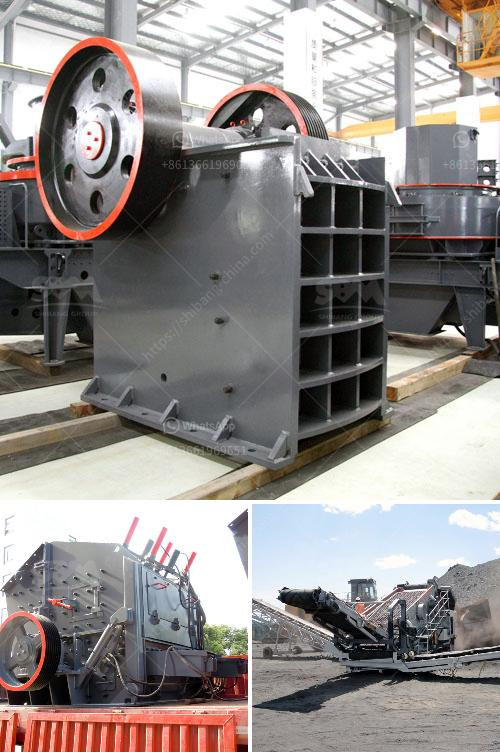

<h3>hammer mill machinery in namibia</h3>
Namibia is a mostly arid country located in southwestern Africa. It is a land of vast landscapes, breathtaking natural beauty, and a predominantly agricultural economy. Agriculture plays a crucial role in the country's economy, providing employment and sustenance to a significant portion of the population. In recent years, the introduction of advanced machinery, such as hammer mills, has revolutionized the agricultural industry in Namibia.

Hammer mills are machines that grind agricultural materials, such as grain, into smaller particles. These machines have been in existence for centuries and have undergone significant advancements over the years. However, the introduction of modern hammer mill machinery has effectively transformed the agricultural sector in Namibia.

One of the key advantages of hammer mills is their versatility. These machines can handle a wide range of materials, making them suitable for various agricultural applications. Farmers in Namibia use hammer mills to process grains like maize, wheat, and sorghum, as well as other materials like vines and wood chips. This versatility allows farmers to diversify their production, giving them the flexibility to explore different markets and maximize their profits.

The efficiency of hammer mills is another significant advantage. These machines can process large volumes of material quickly, reducing the time and effort required for manual grinding. This increased efficiency not only saves farmers precious time but also allows them to process more produce, leading to higher productivity. It is particularly beneficial during peak farming seasons when farmers have to process large quantities of grain.

In addition to increasing productivity, hammer mills also improve the quality of agricultural produce. The machines have adjustable settings that allow farmers to control the size of the final product. This precision ensures that grains are ground uniformly, resulting in a more consistent end product. Farmers can, therefore, meet the stringent quality standards set by domestic and international markets, increasing their chances of securing favorable prices and expanding their customer base.

Another significant advantage of hammer mills is their cost-effectiveness. These machines are relatively affordable, especially when compared to larger and more complex agricultural machinery. The lower cost of hammer mills makes them accessible to small-scale farmers who may not have the financial means to invest in expensive equipment. By making hammer mills widely available, Namibia is empowering small-scale farmers, enabling them to participate actively in the agricultural sector and contribute to the country's economic growth.

The introduction of hammer mill machinery in Namibia has undoubtedly been a gamechanger in the agricultural sector. These versatile, efficient, and cost-effective machines have transformed the way farmers process agricultural materials, enhancing productivity, improving product quality, and expanding market opportunities. As more farmers embrace this technology, Namibia's agricultural sector is poised for further growth and development. The government and relevant stakeholders should continue to support and promote the use of hammer mills, ensuring that all farmers, regardless of scale, can benefit from these modern agricultural tools.
<h3>Contact us</h3><ul><li><strong>Whatsapp:&nbsp;<a href="https://wa.me/8613661969651">+8613661969651</a></strong></li><li><a href="https://swt.shibang-china.com/?git&amp;zhl&amp;hammer mill machinery in namibia"><strong>Online Service(chat now)</strong></a></li></ul><h3>Related</h3><ul><li><a href='ball mills for mica powder.md'>ball mills for mica powder</a></li><li><a href='dealer of steel balls for ball mill in manila.md'>dealer of steel balls for ball mill in manila</a></li><li><a href='cement industry process.md'>cement industry process</a></li><li><a href='price list for belt conveyor pdf.md'>price list for belt conveyor pdf</a></li><li><a href='cost of 500 tonnes per day cement plant ecuador.md'>cost of 500 tonnes per day cement plant ecuador</a></li></ul>