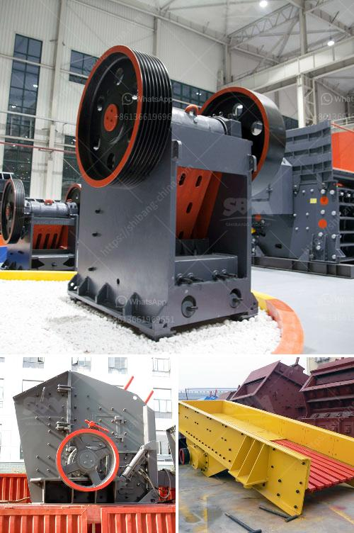

<h3>hammer mill peru</h3>
In Peru, the agricultural sector plays a crucial role in the country's economic growth and development. Over the years, there has been a constant need for efficient and reliable machinery to assist farmers in various agricultural processes. One such machine that has gained significant popularity is the hammer mill.

A hammer mill is a versatile machine that is used for grinding various materials. It consists of a series of hammers mounted on a rotating shaft that strikes and breaks the material into smaller pieces. In the context of agriculture, it is primarily used for grinding grains, such as corn and wheat, into a fine powder.

Peru is a country with a strong agricultural base and a rich diversity of crops. Corn, in particular, is a staple crop for many Peruvians, used in traditional dishes such as ceviche and tamales. The introduction of hammer mills in Peru has revolutionized the process of grinding corn, making it faster, more efficient, and less labor-intensive.

One of the main advantages of a hammer mill is its ability to grind materials into a fine powder. This is especially important for corn, as the fine powder results in a higher yield when used in various food products. In addition, the fine powder produced by the hammer mill can be easily mixed with other ingredients, allowing for the creation of feed blends for livestock.

Another advantage of the hammer mill is its versatility. It can be easily adjusted to grind different materials and achieve the desired particle size. This makes it suitable for not only grinding grains but also other agricultural by-products, such as rice husks and straw. The ability to process a wide range of materials makes the hammer mill a valuable tool for Peruvian farmers, who often have diverse farming needs.

Furthermore, the hammer mill is a cost-effective machine. It requires minimal maintenance and has a long lifespan, making it a wise investment for farmers in Peru. Unlike traditional grinding methods, which can be time-consuming and labor-intensive, the hammer mill allows farmers to save time and effort, increasing their productivity and overall profitability.

In recent years, the demand for hammer mills in Peru has been steadily increasing. More and more farmers are recognizing the benefits they offer and incorporating them into their farming operations. This has not only improved the efficiency of their production processes but also helped to meet the growing demand for agricultural products in the country.

In conclusion, the hammer mill is a prominent machine in Peru's agricultural sector. Its ability to grind various materials into a fine powder, versatility in processing different crops, and cost-effectiveness make it an indispensable tool for Peruvian farmers. The adoption of hammer mills has not only improved the efficiency of agricultural processes but also contributed to the overall growth and development of the agricultural sector in Peru.
<h3>Contact us</h3><ul><li><strong>Whatsapp:&nbsp;<a href="https://wa.me/8613661969651">+8613661969651</a></strong></li><li><a href="https://swt.shibang-china.com/?git&amp;zhl&amp;hammer mill peru"><strong>Online Service(chat now)</strong></a></li></ul><h3>Related</h3><ul><li><a href='granite processing machinery.md'>granite processing machinery</a></li><li><a href='granite cone crusher.md'>granite cone crusher</a></li><li><a href='kenya crusher supplier.md'>kenya crusher supplier</a></li><li><a href='used coal washing plants for sale in pakistan.md'>used coal washing plants for sale in pakistan</a></li><li><a href='limestone primary crushing plant.md'>limestone primary crushing plant</a></li></ul>