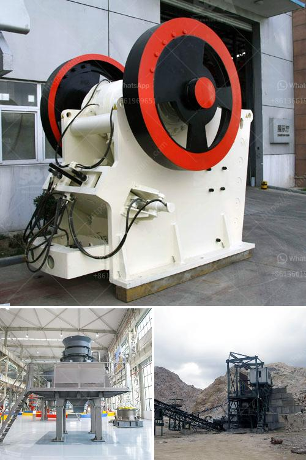

<h3>hammer mill prices south africa</h3>
With the continuous development of the economy in South Africa, the demand for grinding mills has increased significantly. More and more people are purchasing hammer mills for various applications, including grinding grain, wood chips, yard waste, and other materials. However, with the wide range of hammer mill prices in the market, it is not always easy to find the most cost-effective option. In this article, we will take a closer look at the factors that influence hammer mill prices in South Africa.

One of the main factors that determine the price of a hammer mill is its capacity. The capacity refers to the amount of material that the machine can process per hour. Hammer mills with higher capacities are usually more expensive, as they are capable of handling larger volumes of material. However, it is essential to choose the right capacity for your specific needs to avoid overspending on a machine that is unnecessarily large or underutilized.

Apart from capacity, the power of the motor also affects the cost of a hammer mill. Hammer mills with more powerful motors can grind materials faster and more efficiently, which can be an advantage in certain applications. However, a more powerful motor generally means a higher price tag. It is important to consider the nature of your grinding tasks and choose a machine with an appropriate motor power to strike a balance between performance and cost.

Furthermore, the size and weight of the hammer mill can have an impact on its price. Smaller and lighter hammer mills are generally less expensive than larger and heavier models. However, the size and weight should be chosen based on the available space and the intended application of the machine. It is crucial to strike a balance between size, weight, and cost without compromising on functionality and efficiency.

Lastly, the quality and durability of the hammer mill also play a significant role in determining its price. Premium-quality hammer mills made with sturdy materials and superior craftsmanship generally cost more than those with lower build standards. Investing in a high-quality machine ensures that it will last longer, require fewer repairs, and deliver better grinding performance in the long run. While the initial cost may be higher, it can save you money in terms of maintenance and replacement parts over time.

In conclusion, when considering hammer mill prices in South Africa, various factors need to be taken into account to find the most suitable and cost-effective option. Capacity, power, size, weight, and quality are all essential considerations. By thoroughly researching and comparing different models, it is possible to find a hammer mill that meets your specific requirements without breaking the bank. Whether you are a small-scale farmer or an industrial operator, choosing the right hammer mill is crucial for optimizing your grinding operations and maximizing productivity.
<h3>Contact us</h3><ul><li><strong>Whatsapp:&nbsp;<a href="https://wa.me/8613661969651">+8613661969651</a></strong></li><li><a href="https://swt.shibang-china.com/?git&amp;zhl&amp;hammer mill prices south africa"><strong>Online Service(chat now)</strong></a></li></ul><h3>Related</h3><ul><li><a href='gold mining industry in tanzania.md'>gold mining industry in tanzania</a></li><li><a href='costruire une machine pour broyer des briques.md'>costruire une machine pour broyer des briques</a></li><li><a href='roll milling process.md'>roll milling process</a></li><li><a href='dolomite lime manufacturers in ghana.md'>dolomite lime manufacturers in ghana</a></li><li><a href='japan used mine equipment price.md'>japan used mine equipment price</a></li></ul>