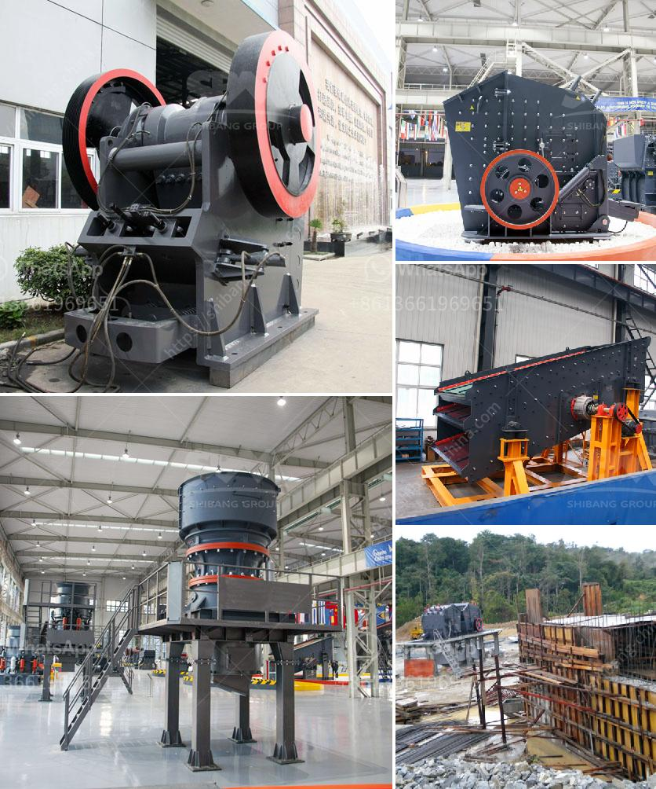

<h3>hammer mills for sale in zimbabwe</h3>
Hammer mills are a staple in the agricultural industry, especially in countries such as Zimbabwe, where farming plays a vital role in the economy. With numerous applications, these mills are used for grinding, crushing, and pulverizing a wide range of materials including maize, grains, hemp, cassava, and more.

In Zimbabwe, hammer mills are predominantly used for grinding maize into mealie-meal, a staple food for the majority of households. This mealie-meal is then used to prepare dishes such as sadza, a thick porridge-like meal that is traditionally consumed with various types of relishes.

The availability of hammer mills for sale in Zimbabwe is an essential factor for the country's food security and sustainable economic growth. However, hammer mills can be expensive to purchase and maintain. To address this, the Zimbabwean government and other organizations have been encouraging small-scale farmers and rural communities to increase their access to these mills through various initiatives.

One such initiative is the establishment of local manufacturing companies that produce and sell hammer mills. These companies not only provide quality mills but also offer after-sales services such as repairs and maintenance. By supporting local manufacturers, farmers can save on costs and contribute to the development of their communities.

There are also organizations in Zimbabwe that facilitate the distribution of hammer mills to rural areas through partnerships and subsidies. These initiatives aim to empower small-scale farmers by giving them access to affordable machinery, improving their productivity, and boosting their income.

In conclusion, the availability of hammer mills for sale in Zimbabwe is crucial for the country's agricultural sector and overall economic development. With the right support and initiatives, small-scale farmers can access these mills more easily, ensuring food security and sustainable farming practices.
<h3>Contact us</h3><ul><li><strong>Whatsapp:&nbsp;<a href="https://wa.me/8613661969651">+8613661969651</a></strong></li><li><a href="https://swt.shibang-china.com/?git&amp;zhl&amp;hammer mills for sale in zimbabwe"><strong>Online Service(chat now)</strong></a></li></ul><h3>Related</h3><ul><li><a href='vertical shaft crusher.md'>vertical shaft crusher</a></li><li><a href='3 roller pulvarising mill manufacturer.md'>3 roller pulvarising mill manufacturer</a></li><li><a href='manual stone crusher in kenya.md'>manual stone crusher in kenya</a></li><li><a href='stone crusher machine from uk.md'>stone crusher machine from uk</a></li><li><a href='stone crushers china.md'>stone crushers china</a></li></ul>