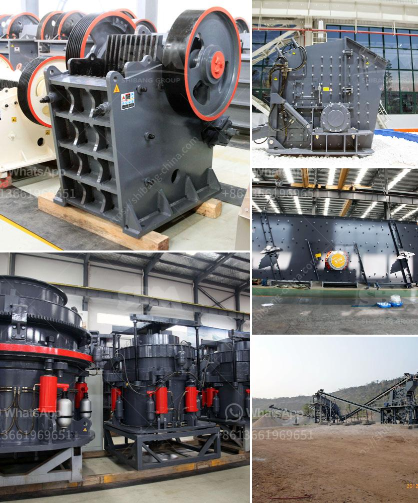

<h3>hammer mills grinding</h3>
When it comes to grinding, industries rely heavily on various machines to turn raw materials into usable products. And one such essential machine is the hammer mill, a versatile grinding tool renowned for its capability to pulverize a wide range of materials into a fine powder.

Hammer mills have been used for centuries in the agricultural and industrial sectors, and their fundamental design has remained relatively unchanged. These machines consist of a rotating shaft that houses free-swinging hammers or knives. The raw material to be processed is fed into the crushing chamber, where the hammers strike and break it into smaller pieces, achieving the desired particle size.

One of the key advantages of hammer mills is their ability to handle a wide range of materials. Whether it's grains, herbs, spices, or even minerals, these mills can efficiently grind them all. They are particularly useful in the pharmaceutical, food processing, and chemical industries, where precise particle size control is crucial.

Hammer mills operate on the principles of impact and attrition. The hammers rotate at high speed, colliding with the incoming material and effectively disintegrating it into finer particles. The size of the final product can be adjusted by changing the size and shape of the hammers.

The use of hammer mills offers numerous benefits that make them the preferred choice for grinding applications. One primary advantage is their affordability. Compared to other grinding machines, hammer mills are relatively inexpensive to purchase and maintain, making them cost-effective solutions for both small-scale operations and large-scale industries.

Furthermore, hammer mills are incredibly versatile machines. Not only can they grind a variety of materials, but they can also perform various tasks, such as size reduction, particle classification, and even drying. This versatility ensures that hammer mills find applications in a wide range of industries, from agriculture and animal feed production to mining and waste management.

Another noteworthy benefit of hammer mills is their high throughput capacity. These machines can process large volumes of materials quickly and efficiently, making them suitable for high-demand applications. Additionally, certain models of hammer mills can be equipped with screens or interchangeable grates to control the size of the final product, further enhancing their adaptability.

The maintenance requirements for hammer mills are also relatively low. Regular inspection, lubrication, and occasional replacement of worn-out parts ensure that the machine functions optimally and has a prolonged lifespan. This aspect makes hammer mills a reliable investment for businesses looking to maximize productivity while minimizing downtime and operating costs.

In conclusion, hammer mills are indispensable machines for grinding various materials into fine powders. Their ability to handle a wide range of materials, affordability, versatility, and high throughput capacity make them ideal for various industries. Furthermore, their low maintenance requirements ensure smooth operations and extended machine lifespan. So, whether you're in the food, pharmaceutical, or chemical industry, a hammer mill can be the grinding solution that brings your raw materials to perfection.
<h3>Contact us</h3><ul><li><strong>Whatsapp:&nbsp;<a href="https://wa.me/8613661969651">+8613661969651</a></strong></li><li><a href="https://swt.shibang-china.com/?git&amp;zhl&amp;hammer mills grinding"><strong>Online Service(chat now)</strong></a></li></ul><h3>Related</h3><ul><li><a href='ball mill catalogue.md'>ball mill catalogue</a></li><li><a href='used crusher plant in dubai for sale.md'>used crusher plant in dubai for sale</a></li><li><a href='sand making plant sand washing plant.md'>sand making plant sand washing plant</a></li><li><a href='aggregate crushing flow chart.md'>aggregate crushing flow chart</a></li><li><a href='gypsum crusher specification.md'>gypsum crusher specification</a></li></ul>