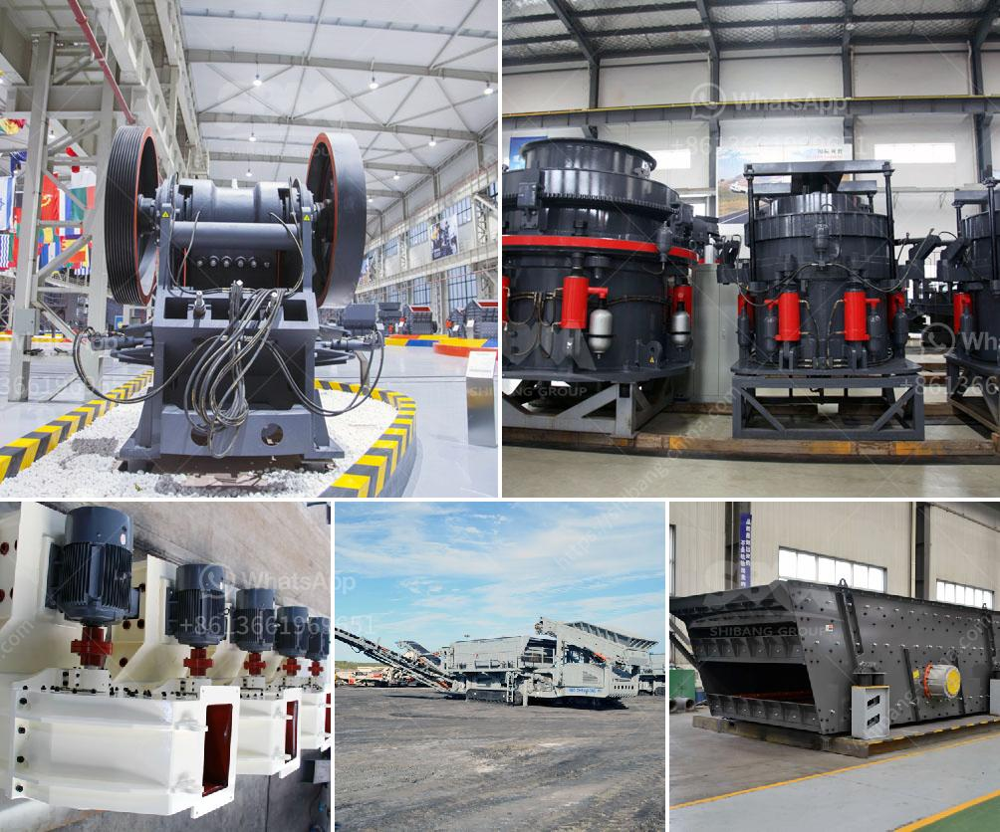

<h3>hammer mills hammer mills</h3>
Hammer mills are machines that are used for size reduction of various materials. These machines consist of a rotor that revolves at high speed and contains a series of hammers. When the material enters the hammer mill, it is pulverized by a combination of hammer blows, particle on particle contact, and impact with the walls of the hammer mill chamber. The material then exits the mill through a screen.

The main advantage of a hammer mill is its versatility. The hammer mill can handle a wide range of materials, including tough and fibrous materials like paper and leaves, as well as softer materials like plastics and wood. This makes it suitable for a diverse range of applications, including shredding, grinding, and pulverizing.

One common use for hammer mills is in the agricultural industry. Farmers use these machines to crush grains into a fine powder, which is then used as animal feed. The powdered grain is easier for animals to digest and provides them with the necessary nutrients. Hammer mills are also used in other industries like brewing and mining, where the crushed materials are used as raw ingredients or to extract valuable minerals.

Another advantage of hammer mills is their low operating costs. These machines have few wear parts and require minimal maintenance. The hammers are usually made of hardened steel and can be re-sharpened multiple times before they need to be replaced. This reduces the overall cost of ownership and makes hammer mills an economical choice for many businesses.

In addition to their versatility and low operating costs, hammer mills are also known for their high productivity. These machines can process a large amount of material quickly, which helps to increase efficiency and reduce processing time. Their high-speed rotation ensures that the particles are pulverized uniformly, resulting in a consistent product.

However, hammer mills also have some limitations. They may not be suitable for all materials, especially those that are extremely hard or abrasive. In such cases, other types of mills, like impact mills or ball mills, may be more appropriate. Hammer mills are also known to produce a significant amount of dust, which can be hazardous if inhaled. Therefore, proper safety precautions, like dust collection systems, should be in place when operating a hammer mill.

In conclusion, hammer mills are versatile and widely used machines that are used for size reduction of various materials. They offer many advantages, including low operating costs, high productivity, and versatility. However, they also have some limitations and safety concerns that need to be addressed. Overall, hammer mills are a valuable tool for many industries, helping to process materials efficiently and economically.
<h3>Contact us</h3><ul><li><strong>Whatsapp:&nbsp;<a href="https://wa.me/8613661969651">+8613661969651</a></strong></li><li><a href="https://swt.shibang-china.com/?git&amp;zhl&amp;hammer mills hammer mills"><strong>Online Service(chat now)</strong></a></li></ul><h3>Related</h3><ul><li><a href='ball mills in lima.md'>ball mills in lima</a></li><li><a href='stone crusher machine made in united states for sale.md'>stone crusher machine made in united states for sale</a></li><li><a href='barangay resolution crushing plant.md'>barangay resolution crushing plant</a></li><li><a href='best marble grinder mill.md'>best marble grinder mill</a></li><li><a href='best crusher for quartz powder.md'>best crusher for quartz powder</a></li></ul>