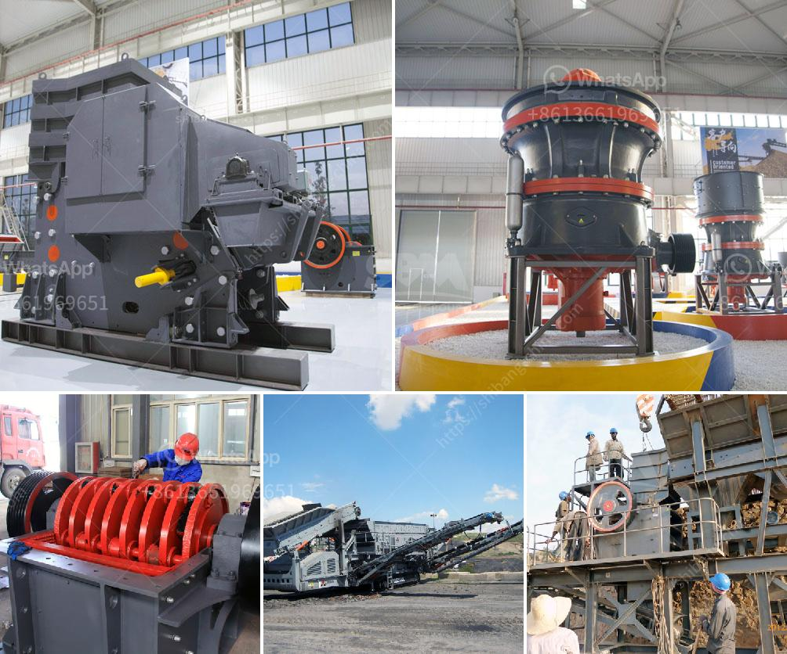

<h3>harare changfa diesel engine</h3>
The Harare Changfa Diesel Engine is a technological marvel that has revolutionized various industries across the globe. With its efficient and reliable power generation capabilities, this engine has become an indispensable tool for farmers, small business owners, and individuals living in remote areas.

One of the key advantages of the Harare Changfa Diesel Engine is its versatility. It can be used to power a wide range of machinery and equipment, including water pumps, generators, rice mills, and agricultural machinery. This makes it an ideal choice for farmers who need a reliable power source to streamline their operations and increase productivity.

Additionally, the Harare Changfa Diesel Engine is known for its impressive fuel efficiency, making it a cost-effective option for users. The engine consumes less fuel compared to other alternatives, significantly reducing operating costs and environmental impact. This attribute is critical in regions where access to fossil fuels may be limited or expensive, further highlighting the engine's suitability for sustainable power generation.

Moreover, the engine's robust design and durability ensure that it can withstand harsh operating conditions. This is particularly advantageous for users in remote areas, where maintenance and repair services may be limited. The Harare Changfa Diesel Engine's ability to endure tough environments ensures uninterrupted power supply, contributing to enhanced productivity and improved quality of life for users.

Furthermore, the Harare Changfa Diesel Engine has played a crucial role in bridging the energy gap in developing countries. Many regions lack access to reliable electricity, impairing economic growth and quality of life. The engine presents a practical and affordable solution, empowering communities to harness power independently and drive progress in various sectors.

In conclusion, the Harare Changfa Diesel Engine is a game-changer in the world of power generation. Its versatility, fuel efficiency, durability, and contribution to sustainable development make it an ideal choice for individuals and industries alike. As technology continues to evolve, the Harare Changfa Diesel Engine remains at the forefront of innovation and progress, empowering communities worldwide and shaping a brighter future.
<h3>Contact us</h3><ul><li><strong>Whatsapp:&nbsp;<a href="https://wa.me/8613661969651">+8613661969651</a></strong></li><li><a href="https://swt.shibang-china.com/?git&amp;zhl&amp;harare changfa diesel engine"><strong>Online Service(chat now)</strong></a></li></ul><h3>Related</h3><ul><li><a href='gold crusher equipment.md'>gold crusher equipment</a></li><li><a href='small gypsum crushing machines australia.md'>small gypsum crushing machines australia</a></li><li><a href='ball mill for quartz grinding gujarat.md'>ball mill for quartz grinding gujarat</a></li><li><a href='capital requirement for one ton cement mill.md'>capital requirement for one ton cement mill</a></li><li><a href='cost of gold bow mill for sale in south africa.md'>cost of gold bow mill for sale in south africa</a></li></ul>