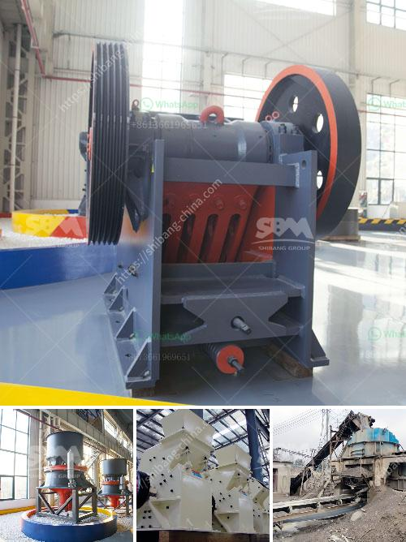

<h3>hard rock ball mill specs</h3>
The hard rock ball mill is a type of grinding mill used specifically for crushing and grinding various hard materials, such as ores, granite, iron ore, copper ore, gold ore, limestone, lead-zinc ore, bauxite, and other minerals. It has been widely used in industries like mining, metallurgy, construction, ceramics, and chemical engineering.

One of the key factors that make the hard rock ball mill unique is its high crushing and grinding efficiency. Thanks to its robust design and the use of premium quality materials, it can handle even the toughest materials with ease. The mill's shell and grinding media are made of durable steel, ensuring long-lasting performance and minimum wear and tear.

The hard rock ball mill comes in various specifications to suit different applications and processing requirements. It typically ranges in size from 0.3 meters to 6 meters in diameter and can be equipped with single or multiple chambers. The number and size of grinding balls can also be customized, depending on the desired fineness and output capacity.

In addition to its efficiency, the hard rock ball mill is also known for its versatility. It can be used for both wet and dry grinding processes, allowing operators to adapt to changing ore properties. The mill can be operated in a batch or continuous mode, providing flexibility in terms of production volume and process control.

Furthermore, safety is a top priority in the design of the hard rock ball mill. It is equipped with various safety features, such as an emergency stop button and a protective housing that prevents access to moving parts.

Overall, the hard rock ball mill is a reliable and efficient tool for crushing and grinding hard materials. With its high performance, versatility, and user-friendly design, it is an indispensable machine in various industries where size reduction and particle size control are critical.
<h3>Contact us</h3><ul><li><strong>Whatsapp:&nbsp;<a href="https://wa.me/8613661969651">+8613661969651</a></strong></li><li><a href="https://swt.shibang-china.com/?git&amp;zhl&amp;hard rock ball mill specs"><strong>Online Service(chat now)</strong></a></li></ul><h3>Related</h3><ul><li><a href='crushing plant process flow.md'>crushing plant process flow</a></li><li><a href='jaw crushing machine.md'>jaw crushing machine</a></li><li><a href='aggregate crushing machines.md'>aggregate crushing machines</a></li><li><a href='100tpd crusher plant.md'>100tpd crusher plant</a></li><li><a href='sand powder milling machine.md'>sand powder milling machine</a></li></ul>