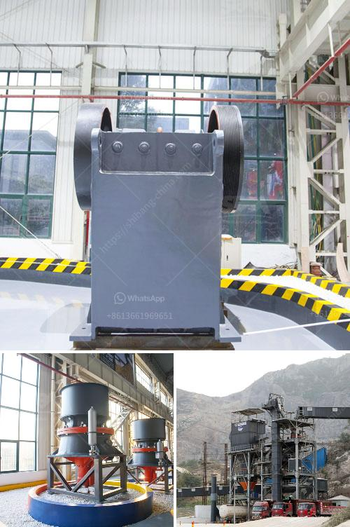

<h3>harga stone crusher kapasitas 200 ton jam</h3>
Stone crusher production capabilities vary from 100 to 600 tons per hour. A jaw crusher, on the other hand, requires an E motor in the 150-200 watt range to enable it to handle rock with a hardness rating of 8 or above. The motor extracts energy from the conveyor belts with a force 10 times that of gravity.

Quarry operations necessitate the use of high-capacity and efficient crushers to handle and process various types of rock and aggregate. The harga stone crusher kapasitas 200 ton jam (price of stone crusher capacity 200 tons per hour) is an important reference for everyone seeking to understand the production side of quarry operations.

The article specifically aims to discuss the solution for local quarry capacity enhancement. The stone crusher, or commonly known as rock crusher, can be classified into various types depending on the existing technology and capacity. The capacity is designed according to the required production input, ranging from 50 to 700 tons per hour. This is determined by the characteristics of the raw materials and the desired end product specifications.

With a capacity of 200 tons per hour, the harga stone crusher kapasitas 200 ton jam effectively meets quarry demands. The machine is designed to operate non-stop, minimizing downtime and providing optimal productivity. It is equipped with high-quality components to ensure durability and reliability in harsh quarry environments.

Additionally, the harga stone crusher kapasitas 200 ton jam is equipped with advanced features such as a feeding system that enables the crusher to accept rock boulders and ensure smooth material flow. Moreover, the machine is equipped with a powerful motor and a hydraulic system to assist in adjusting and controlling the desired end-product size.

In conclusion, the harga stone crusher kapasitas 200 ton jam is a suitable option for small to medium-sized quarry operations that require the efficient processing of aggregates. The crusher offers significant cost savings over traditional labor-intensive methods and provides a solution for enhancing capacity in local quarries. With its robust construction and advanced features, it ensures high productivity and durability in challenging environments.
<h3>Contact us</h3><ul><li><strong>Whatsapp:&nbsp;<a href="https://wa.me/8613661969651">+8613661969651</a></strong></li><li><a href="https://swt.shibang-china.com/?git&amp;zhl&amp;harga stone crusher kapasitas 200 ton jam"><strong>Online Service(chat now)</strong></a></li></ul><h3>Related</h3><ul><li><a href='copper concentrate plant manufacturers in south africa.md'>copper concentrate plant manufacturers in south africa</a></li><li><a href='costruire une machine pour broyer des briques.md'>costruire une machine pour broyer des briques</a></li><li><a href='crushing plant process flow.md'>crushing plant process flow</a></li><li><a href='conveyor belts contacts.md'>conveyor belts contacts</a></li><li><a href='mill price for minerals in bolivia.md'>mill price for minerals in bolivia</a></li></ul>