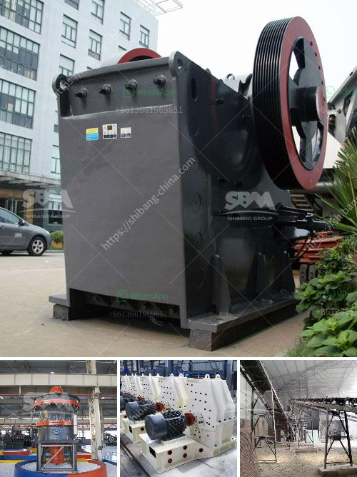

<h3>harga stone crusher kapsitas 20 ton</h3>
Stone crushers are indispensable equipment in the construction industry. They are used to break down larger rocks into smaller, more manageable pieces. A stone crusher with a capacity of 20 tons is a significant investment for any construction project. With the numerous benefits that come with purchasing this equipment, it is important to ensure that you get the best value for your money.

The harga stone crusher kapsitas 20 ton refers to the capacity of the stone crusher. This crusher is capable of producing 20 tons of crushed stone per hour. Of course, this capacity can vary depending on the specific materials and hardness of the rocks being crushed. However, with a capacity of 20 tons, it is possible to complete small to medium-sized construction projects efficiently and in a timely manner.

One of the main advantages of investing in a stone crusher with a capacity of 20 tons is increased productivity. Instead of manually breaking rocks, which can be time-consuming and labor-intensive, this equipment allows for quicker and more efficient stone crushing. This, in turn, leads to enhanced productivity on the job site, ultimately reducing the overall project completion time.

Moreover, the harga stone crusher kapsitas 20 ton can help you save on labor costs. With its high efficiency in crushing rocks, you can accomplish more with fewer workers. This means that you can allocate your budget to other important aspects of your construction project, such as materials or specialized labor.

Another benefit of investing in a stone crusher is the ability to produce quality aggregates. Whether you need crushed stone for concrete, road base, or other construction applications, a stone crusher can provide you with the right-sized materials. By controlling the size of the output, you can ensure that the aggregates meet the specifications and requirements of your project.

When looking for a harga stone crusher kapsitas 20 ton, it is important to consider factors such as reliability, durability, and after-sales service. You want to invest in a reliable machine that will withstand the demands of a construction site environment. Additionally, choose a supplier that offers excellent after-sales support to address any issues or concerns that may arise.

In conclusion, the harga stone crusher kapsitas 20 ton is a valuable asset for any construction project. With its ability to break down rocks efficiently and produce quality aggregates, this equipment can significantly enhance productivity and save on labor costs. When making this investment, ensure that you choose a reliable supplier who offers excellent after-sales support. By doing so, you can make your construction projects more efficient and successful.
<h3>Contact us</h3><ul><li><strong>Whatsapp:&nbsp;<a href="https://wa.me/8613661969651">+8613661969651</a></strong></li><li><a href="https://swt.shibang-china.com/?git&amp;zhl&amp;harga stone crusher kapsitas 20 ton"><strong>Online Service(chat now)</strong></a></li></ul><h3>Related</h3><ul><li><a href='marble stone milling plant.md'>marble stone milling plant</a></li><li><a href='ball mill hou feng in china.md'>ball mill hou feng in china</a></li><li><a href='gold mill for sale in zimbabwe.md'>gold mill for sale in zimbabwe</a></li><li><a href='gravel crushers machine.md'>gravel crushers machine</a></li><li><a href='china best crusher manufacturers.md'>china best crusher manufacturers</a></li></ul>