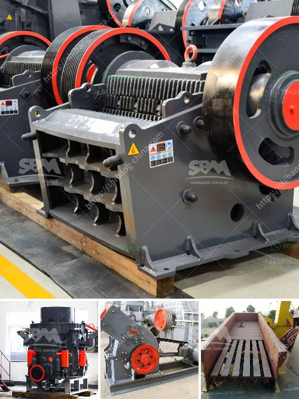

<h3>high capacity high quality cone crusher to rent</h3>
Are you in the construction or mining industry and need a high-capacity, high-quality cone crusher for your operations? If so, you're in luck because there are several options available for rent. Cone crushers are crucial equipment for reducing large rocks into smaller ones to be used in various construction and mining applications. Let's take a closer look at why renting a high-capacity, high-quality cone crusher may be the perfect solution for your needs.

First and foremost, renting a cone crusher offers a cost-effective alternative to purchasing one outright. Buying a cone crusher can be expensive, and not all businesses have the financial resources to invest in a brand-new machine. Renting allows you to access the latest technology without a significant upfront investment. You also won't have to worry about maintenance costs and can easily return the machine once you've completed your project.

Another advantage of renting a high-capacity, high-quality cone crusher is the flexibility it provides. Different projects require different sizes and specifications of crushed materials, and cone crushers can be adjusted to produce the desired output. Renting allows you to choose a crusher that suits your specific needs for each project, ensuring optimal results and efficiency.

When it comes to cone crushers, high capacity and high quality go hand in hand. In order to handle the toughest materials, you need a machine that can operate at peak performance without compromising on quality. High-capacity cone crushers are designed to deliver exceptional throughput, while also ensuring consistent particle size and shape.

Renting a high-quality cone crusher means you'll benefit from advanced technology and engineering. These machines are built to withstand demanding environments and heavy-duty applications. They are equipped with cutting-edge features such as hydraulic systems for easy adjustment of crusher settings, automatic tramp release for unblocking the crusher, and advanced liner profiles for optimal wear life.

Moreover, renting a cone crusher from a reputable supplier ensures that you'll receive excellent customer support and service. If any issues or concerns arise during your rental period, you can rely on the supplier's expertise to address them promptly and effectively. This level of support can be invaluable, especially when working on tight deadlines or dealing with challenging materials.

In conclusion, renting a high-capacity, high-quality cone crusher offers numerous benefits for businesses in the construction and mining industries. It provides a cost-effective solution, flexibility in meeting different project requirements, and access to advanced technology and engineering. By choosing a reputable supplier, you can ensure optimal performance and receive excellent customer support. So, if you're in need of a cone crusher, consider renting one to maximize your productivity and efficiency.
<h3>Contact us</h3><ul><li><strong>Whatsapp:&nbsp;<a href="https://wa.me/8613661969651">+8613661969651</a></strong></li><li><a href="https://swt.shibang-china.com/?git&amp;zhl&amp;high capacity high quality cone crusher to rent"><strong>Online Service(chat now)</strong></a></li></ul><h3>Related</h3><ul><li><a href='indonesia ball mill manufacturer.md'>indonesia ball mill manufacturer</a></li><li><a href='gold mining used jaw crusher.md'>gold mining used jaw crusher</a></li><li><a href='harare changfa diesel engine.md'>harare changfa diesel engine</a></li><li><a href='provider of conveyor belts for mining.md'>provider of conveyor belts for mining</a></li><li><a href='stone crusher machines.md'>stone crusher machines</a></li></ul>