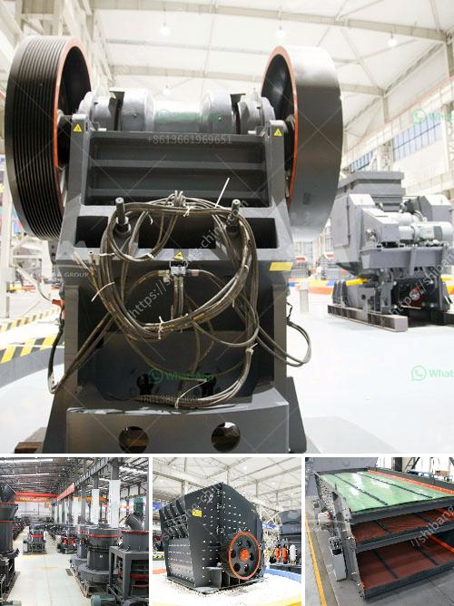

<h3>high performance mobile crusher plant</h3>
In the ever-evolving world of technology, advancements have brought about remarkable changes in the way we live and work. The mining and construction industry, in particular, has witnessed significant improvements with the introduction of high-performance mobile crusher plants. With their enhanced capabilities, these state-of-the-art machines offer an efficient solution to crushing and screening processes, ensuring the completion of projects on time and within budget.

One of the key advantages of a high-performance mobile crusher plant is its ability to store and transport all necessary equipment, saving both time and effort. Gone are the days when crushing plants required costly and cumbersome infrastructure. With this innovation, operators now have the freedom to move their crushing equipment across various job sites without the need for reassembly, promoting overall efficiency.

The ability to adapt to different environments is another key feature of mobile crusher plants. Whether operating in a rugged mining site or a busy construction zone, these plants are designed to handle a wide range of materials and can adjust the crusher settings to suit specific requirements. This adaptability allows operators to maximize production, regardless of the conditions, resulting in superior performance and productivity.

The high-performance mobile crusher plants are equipped with advanced technology that enhances operational efficiency, such as automated control systems. These control systems enable operators to regulate various parameters, ensuring the optimal performance of the crusher. Additionally, they provide real-time monitoring and data analytics, allowing for proactive maintenance and troubleshooting, minimizing downtime and maximizing productivity.

Furthermore, the incorporation of advanced screening systems in mobile crusher plants ensures the production of high-quality end products. Efficient screening mechanisms not only separate oversized materials but also guarantee consistent particle sizes, meeting the desired specifications. This level of precision helps eliminate unnecessary waste and improve overall project outcomes.

Apart from offering enhanced efficiency and productivity, high-performance mobile crusher plants also prioritize environmental sustainability. These innovative machines are designed to minimize energy consumption and reduce carbon footprint. Advanced engines and power systems ensure lower emissions, making them more eco-friendly compared to conventional crushers. Additionally, the mobility factor diminishes transportation-related carbon emissions, contributing to a greener and more sustainable future.

The advent of high-performance mobile crusher plants has revolutionized the mining and construction industry in more ways than one. These flexible and versatile machines facilitate easy transportation, adapt to various environments, and incorporate advanced technology to enhance efficiency and performance. Furthermore, their eco-friendly design provides a sustainable solution to the growing demand for crushing and screening services while reducing environmental impact.

As we move towards a future that demands productivity, sustainability, and adaptability, high-performance mobile crusher plants offer a perfect blend of innovation and practicality. With their capabilities, these machines have become an indispensable part of the industry, allowing operations to streamline processes, reduce costs, and achieve outstanding results.
<h3>Contact us</h3><ul><li><strong>Whatsapp:&nbsp;<a href="https://wa.me/8613661969651">+8613661969651</a></strong></li><li><a href="https://swt.shibang-china.com/?git&amp;zhl&amp;high performance mobile crusher plant"><strong>Online Service(chat now)</strong></a></li></ul><h3>Related</h3><ul><li><a href='magnetic separator for iron sand.md'>magnetic separator for iron sand</a></li><li><a href='conveyor belts for sale in china.md'>conveyor belts for sale in china</a></li><li><a href='grinding mills for ore.md'>grinding mills for ore</a></li><li><a href='grinding media balls turkey.md'>grinding media balls turkey</a></li><li><a href='regulatory conveyor belts.md'>regulatory conveyor belts</a></li></ul>