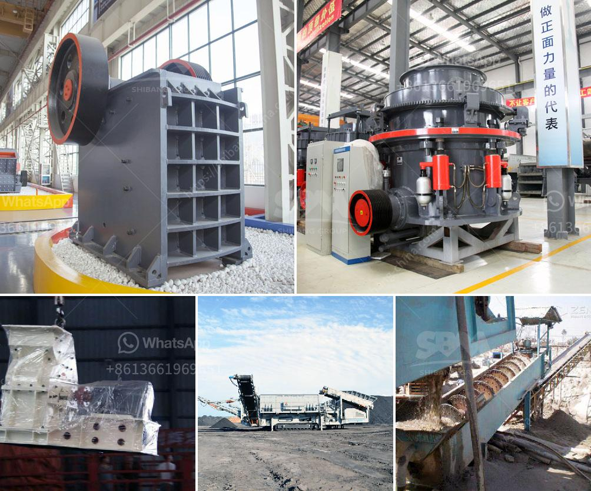

<h3>high purity quartz crusher processing</h3>
High purity quartz is a valuable raw material that is often used in high-tech industries such as electronics, optics, and telecommunications. As the demand for high purity quartz continues to rise, it is essential to find efficient and cost-effective ways of processing this material. One of the key steps in the processing of high purity quartz is the crushing and grinding of the raw ore.

Crushing and grinding are essential steps in the extraction process that converts high purity quartz into a usable product. However, the process requires a lot of energy and specialized machinery. This is where a high purity quartz crusher comes in.

A high purity quartz crusher is a machine that is designed to reduce particle size and increase overall production capacity in quartz-based industries such as glass manufacturing, electronics, and ceramics. The machine works by applying high pressure on the material to crush it into smaller particles. This process is recommended for low to medium hardness materials such as quartz.

There are various types of high purity quartz crushers available in the market. They come in different sizes, designs, and capacities to meet the diverse needs of the industry. Some crushers are designed to work in conjunction with other equipment such as screens and conveyors to ensure a smooth and efficient production process.

One of the advantages of using a high purity quartz crusher is that it helps eliminate impurities and ensures the final product meets the required specifications. The crusher breaks down the raw ore, removing unwanted impurities such as iron oxide, mica, and other minerals. This results in a high purity quartz product that is suitable for use in various high-tech applications.

In conclusion, a high purity quartz crusher is a crucial piece of equipment in the processing of high purity quartz. It helps break down the raw ore into smaller particles, reducing impurities and ensuring a high-quality final product. As the demand for high purity quartz continues to grow, the need for efficient and reliable crushers will also increase. Investing in a high purity quartz crusher is a wise decision for companies operating in quartz-based industries.
<h3>Contact us</h3><ul><li><strong>Whatsapp:&nbsp;<a href="https://wa.me/8613661969651">+8613661969651</a></strong></li><li><a href="https://swt.shibang-china.com/?git&amp;zhl&amp;high purity quartz crusher processing"><strong>Online Service(chat now)</strong></a></li></ul><h3>Related</h3><ul><li><a href='horizontally ball mill production russia.md'>horizontally ball mill production russia</a></li><li><a href='vibrating grinding mill ball china.md'>vibrating grinding mill ball china</a></li><li><a href='quartz powder suppliers in dubai.md'>quartz powder suppliers in dubai</a></li><li><a href='granite price in kandy srilanka.md'>granite price in kandy srilanka</a></li><li><a href='precipitated calcium carbonate manufacturing machinery.md'>precipitated calcium carbonate manufacturing machinery</a></li></ul>