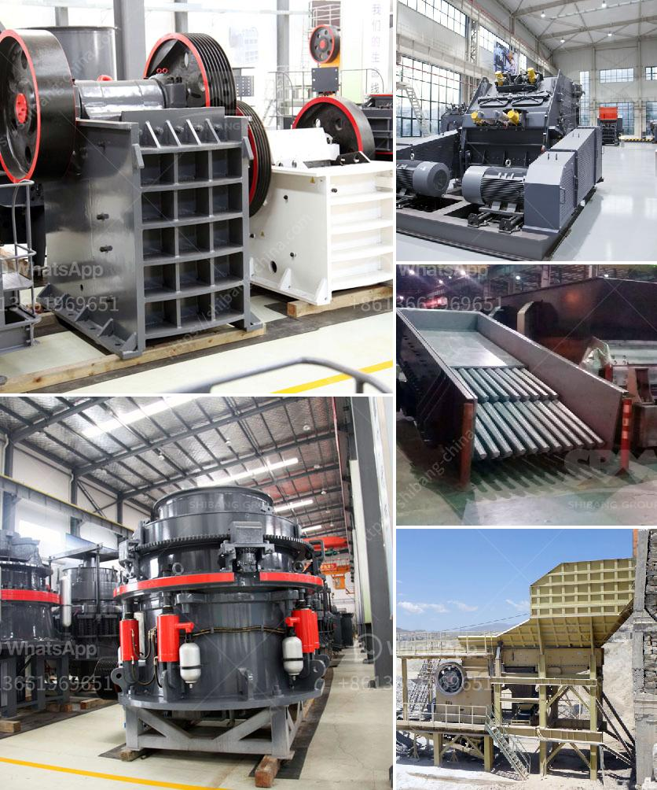

<h3>high speed limestone milling machine</h3>
High-speed limestone milling machine is an important equipment for grinding limestone. It is widely used in cement, silicate products, new building materials, refractory materials, fertilizers, black and non-ferrous metal beneficiation, and glass ceramics production industries. It has been successfully applied in various industries, making limestone powder widely used in various industries.

Limestone is a common non-metallic mineral and a valuable resource. With the increasing demand for limestone products in various industries, the market demand for limestone powder is also increasing. The high-speed limestone milling machine is an important equipment for grinding limestone into fine powder, which is widely used in various industries.

The high-speed limestone milling machine has the advantages of small size, compact structure, high efficiency, and large output. It has the characteristics of energy-saving and environmental protection, low noise, and less dust. It adopts advanced grinding technology, which can effectively improve the grinding efficiency, and the finished product has good quality and uniform particle size.

The high-speed limestone milling machine has a wide range of applications. It can grind various materials with Mohs hardness below 9.3 and humidity below 6%. In addition to limestone, it can also grind barite, calcite, marble, dolomite, talc, gypsum, and other materials. It can be used for grinding non-metallic minerals with a hardness of less than 7 and a humidity of less than 6%.

The high-speed limestone milling machine has a simple operation process, easy maintenance, and can achieve automatic control. It is equipped with a high-precision analysis system, which can control the grading efficiency and fineness of the finished product, and can be arbitrarily adjusted according to the needs of different users.

In the production process of limestone grinding, the high-speed limestone milling machine adopts a closed-circuit grinding system. The material is continuously and evenly fed into the grinding chamber through the vibrating feeder. The grinding roller assembly, grinding disc, and hydraulic system are used to pressurize the grinding roller to grind the material. After the ground material passes through the classifier, it collects the qualified powder and sends it to the finished product storage. The unqualified powder is returned to the grinding chamber for re-grinding until it meets the requirements.

In summary, the high-speed limestone milling machine is a necessary equipment for grinding limestone into powder. It has the advantages of high grinding efficiency, environmental protection, energy saving, and wide application range. It is widely used in cement, silicate products, new building materials, refractory materials, fertilizers, black and non-ferrous metal beneficiation, and glass ceramics production industries. With the continuous development of various industries, the market demand for limestone powder is increasing, and the high-speed limestone milling machine will have a bright future.
<h3>Contact us</h3><ul><li><strong>Whatsapp:&nbsp;<a href="https://wa.me/8613661969651">+8613661969651</a></strong></li><li><a href="https://swt.shibang-china.com/?git&amp;zhl&amp;high speed limestone milling machine"><strong>Online Service(chat now)</strong></a></li></ul><h3>Related</h3><ul><li><a href='sand washing plant suppliers.md'>sand washing plant suppliers</a></li><li><a href='japan jaw crusher machine.md'>japan jaw crusher machine</a></li><li><a href='used gold mining equipment for sale in ghana.md'>used gold mining equipment for sale in ghana</a></li><li><a href='crusher mobile stone crusher.md'>crusher mobile stone crusher</a></li><li><a href='copper mining equipment suppliers south america.md'>copper mining equipment suppliers south america</a></li></ul>