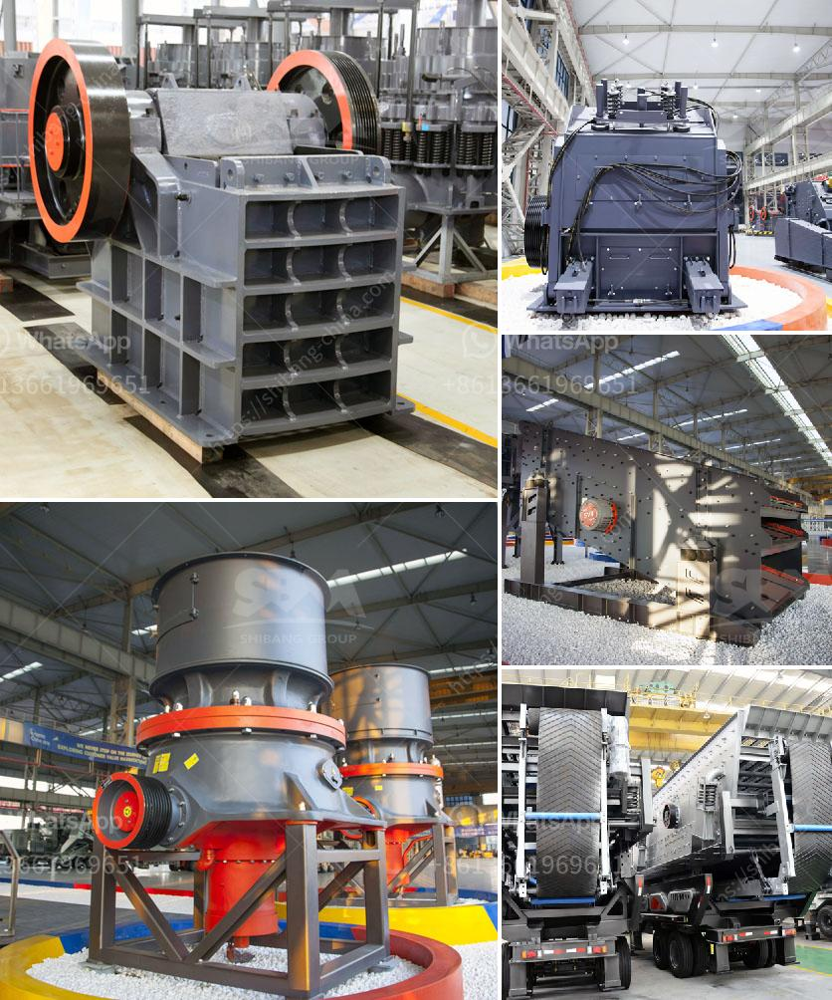

<h3>horizontally ball mill production russia</h3>
Russia, being one of the largest global economies, provides various opportunities for industries to thrive. One such industry is the production of ball mills, a crucial equipment for grinding and crushing different materials. Horizontally ball mill production in Russia has seen significant growth over the years, contributing to the country's industrial expansion.

A horizontally ball mill is a cylindrical machine used for grinding and crushing materials into smaller particles. It operates by rotating a hollow cylinder on its horizontal axis, causing the media and materials inside to tumble, cascade, and mix, resulting in the desired fineness of the product. This type of mill is widely used in industries like mining, cement, and chemicals.

Russia's ball mill production has been fueled by its vast reserves of raw materials, such as coal, iron ore, and nickel. The country's rich natural resources have laid the foundation for a robust mining industry, which requires efficient grinding equipment like ball mills. The demand for horizontally ball mills in Russia has therefore increased significantly, leading to a rise in production.

Moreover, the investment in research and development of ball mill technology has driven the advancement of horizontally ball mills in Russia. The country's engineering capabilities have allowed manufacturers to develop cutting-edge designs, improving the efficiency, reliability, and productivity of the mills. This has attracted both domestic and international investments in the sector, further boosting production.

The growth of horizontally ball mill production in Russia has also been supported by favorable government policies and incentives. The authorities have implemented measures to attract foreign direct investment and promote local manufacturing. These initiatives have created a conducive environment for the industry, fostering its expansion and creating employment opportunities for the local workforce.

In conclusion, horizontally ball mill production in Russia has experienced substantial growth due to various factors such as abundant raw materials, advancements in technology, and government support. The industry's success has led to its crucial role in the country's economy, contributing to its overall industrial development. As Russia continues to invest in its mining and manufacturing sectors, the production of horizontally ball mills is poised to further flourish in the coming years.
<h3>Contact us</h3><ul><li><strong>Whatsapp:&nbsp;<a href="https://wa.me/8613661969651">+8613661969651</a></strong></li><li><a href="https://swt.shibang-china.com/?git&amp;zhl&amp;horizontally ball mill production russia"><strong>Online Service(chat now)</strong></a></li></ul><h3>Related</h3><ul><li><a href='cost analysis of running a crusher plant.md'>cost analysis of running a crusher plant</a></li><li><a href='mini sandstone crusher price.md'>mini sandstone crusher price</a></li><li><a href='mobile crusher manufacturers.md'>mobile crusher manufacturers</a></li><li><a href='dolomite processing plan in ethiopia.md'>dolomite processing plan in ethiopia</a></li><li><a href='mining process of limestone.md'>mining process of limestone</a></li></ul>