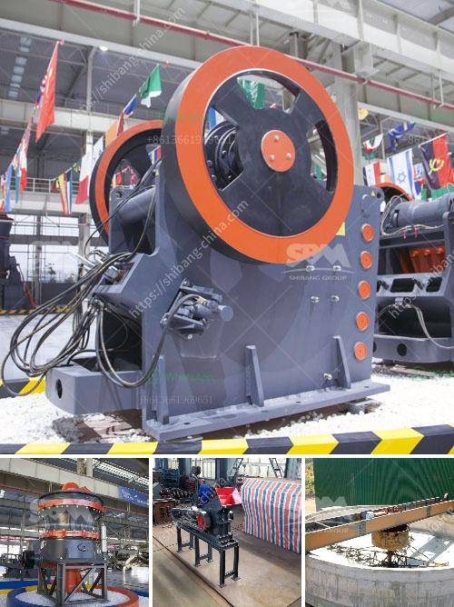

<h3>how much does a mobile crusher cost</h3>
Mobile crushing plants are renowned worldwide for their quality construction, crushing efficiency, versatility, and profitability. However, how much a mobile crusher plant cost is not a straightforward answer due to various factors. This article will delve into factors that determine the cost of a mobile crusher, including acquisition, installation, and maintenance requirements.

One of the most noticeable factors influencing a mobile crusher plant’s cost is the equipment. With manufacturers relying on tonnes of metal, components, and heavy machinery to enable their crushers to handle thousands of tonnes of rocks, ore, minerals, and construction refuse that investors will rely on. Therefore, investing in a mobile crusher plant for sale requires considerable expenditures on not only purchasing, but also subsequent maintenance costs.

Looking closely at the costs associated with mobile crusher plants, you’ll notice that there are generally two options available. Machines sold by reputable manufacturers with warranty periods and machines that can be refurbished and rebuilt for more affordable prices.

The cost of acquiring a mobile crusher plant is determined by the price of the equipment, its transportation, and installation. For instance, if you are to import a machine from another country, you should factor in logistical expenses. On the other hand, smaller plants, with less-intensive design and installation processes, can be quite affordable, especially due to their ability to be installed into trailers and containers.

Nevertheless, when comparing with a fixed crusher plant, a mobile crusher plant often has a higher cost per tonne. To ensure you can get the most out of your investment, consider testimonials, reviews, and evaluations of these machines to verify their utility and durability.

When it comes to installation, a mobile crusher plant provides contractors with a lot of flexibility. However, this flexibility comes with a price. Mobile crushers consist of three main components: feeders, crushers, and conveyors. Mobile crushers can reduce rock, concrete, and other debris to the size of gravel, and they can maneuver themselves around a work site—but not at the same time. That’s how these dual-purpose machines can get away with having a single hydraulic power unit. If the mountain won’t come to Muhammed, then Muhammed must go to the mountain. With the help of hydraulic systems, a mobile crusher can take flexibility to the extreme with a wide range of features.

Take the mobile tire crusher for example: Its design avoids refurbishment and repair on the hydraulic system; thus, saving maintenance costs greatly. And the benefits of it are that it can integrate various functions of crushing equipment into one. It is fully automated, saving labor costs; the finished aggregates are uniform, and the shape is reasonable, and the; it can process natural rock with high hardness.

To sum up, the cost of a mobile crusher plant depends on many factors, ranging from the configuration to the firmness of the raw materials, its geographical location, logistics, and transportation costs. The following is a detailed analysis of these factors.

First, the configuration of the mobile crusher plant. The mobile crusher plant is a kind of production equipment with certain mobile performance and can be used independently, flexible and adaptable. The integrated assembly form of the mobile crusher eliminates the complex installation operation of the infrastructure components, reducing the material and working hours consumption.

Additionally, the cost of transporting the mobile crusher to the job site and the installation itself will be included in the total cost. However, when comparing the manufacturers' prices, it is necessary to analyze the quality of the equipment. Some manufacturers sell the mobile crusher at an exorbitant amount when compared to the quality and performance standards, which cannot be considered a wise choice.

Secondly, the rock crushing equipment has large production capacity. The cone crusher has higher speed stroke, so the rated power of the cone crusher is increased, and the processing capacity of the equipment is greatly improved. Thirdly, this rock crusher machine has a two-way iron release hydraulic cylinder, which allows the iron to go through the crushing chamber, and reduces the shutdown due to debris in the crushing chamber.

Finally, the reliability, serviceability, and ease of operation of the mobile crusher plant are among one of the most significant factors in its price. Cost-efficiency and sustainability in terms of lifespan and maintenance can drastically lower purchasing costs. However, this often has a detrimental effect on customers' sense of security, which can result in limited customer support.

In conclusion, a mobile crusher plant is an investment that companies must make because it enables them to assume a competitive edge in the market. Cheap and substandard machines may seemingly save you money in the short run, but if they don't meet the quality requirements, they will have a significant impact on your long-term prospects. Thus, it is essential to make your choice wisely and get the most out of your investment.
<h3>Contact us</h3><ul><li><strong>Whatsapp:&nbsp;<a href="https://wa.me/8613661969651">+8613661969651</a></strong></li><li><a href="https://swt.shibang-china.com/?git&amp;zhl&amp;how much does a mobile crusher cost"><strong>Online Service(chat now)</strong></a></li></ul><h3>Related</h3><ul><li><a href='construction crusher price.md'>construction crusher price</a></li><li><a href='used gold mining equipment for sale in ghana.md'>used gold mining equipment for sale in ghana</a></li><li><a href='top ten cement plant epc contractor.md'>top ten cement plant epc contractor</a></li><li><a href='how much price of ball mill.md'>how much price of ball mill</a></li><li><a href='list of equipments for a quarry crusher.md'>list of equipments for a quarry crusher</a></li></ul>