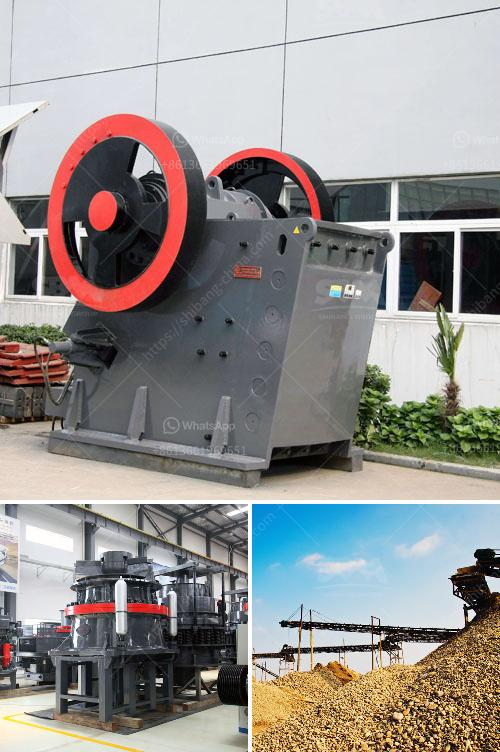

<h3>how much does gold ore cost</h3>
Gold ore, the raw material used to extract gold from the earth, has captivated human beings for centuries. Its enchanting allure and undeniable value have positioned gold as one of the most coveted metals worldwide. But have you ever wondered about the cost of gold ore? In this article, we will explore the various factors that influence the price of gold ore.

The price of gold ore is determined by a multitude of factors. Primarily, the cost of gold ore is dependent on the purity and quantity of gold it contains. The purity of gold is measured in karats, with 24 karats being the purest form. Gold ores of higher purity, containing more gold per unit weight, are generally more expensive.

Another crucial factor that affects the cost of gold ore is its accessibility. Gold deposits are found all over the world, but not all of them are easy to access and mine. If a gold ore deposit is situated in a remote or challenging location, the costs of extraction, transportation, and infrastructure can significantly impact the final price.

The mining method used also plays a vital role in determining the cost of gold ore. Traditional mining techniques, such as open-pit mining, can be more cost-effective, but they yield lower-grade ores. These ores contain less gold per ton, thus reducing their overall value. In contrast, underground mining methods, while more expensive, tend to yield higher-grade ores with a higher gold content.

Furthermore, market demand and geopolitical factors heavily influence the price of gold ore. Gold has been a safe-haven investment for centuries, often sought after during times of economic instability or uncertainty. A rise in demand, driven by market conditions, can lead to an increase in the cost of gold ore. Geopolitical events, such as political unrest or trade disputes, can also impact the price of gold ore as investors seek a reliable store of value.

Additionally, the cost of processing and refining gold ore must be taken into account. After extraction, gold ore undergoes various processes to remove impurities and separate the gold from other minerals. These processes, including crushing, grinding, and chemical treatments, require substantial energy, labor, and infrastructure, which contribute to the overall cost of gold ore.

It is also important to note that the price of gold ore is subject to fluctuations in the global gold market. Gold is traded globally, and its price can experience significant volatility due to various factors, such as changes in interest rates, currency fluctuations, and economic indicators. These market dynamics can influence the price of gold ore, just as they impact the price of gold bullion or gold jewelry.

In conclusion, the cost of gold ore varies based on multiple factors, including its purity, accessibility, mining method, market demand, geopolitical conditions, and processing expenses. As gold continues to remain a symbol of wealth and a safe-haven investment, the cost of gold ore will consistently reflect its rarity and intrinsic value. So, the next time you ponder the worth of this precious metal, consider all the intricate components that contribute to the price of gold ore.
<h3>Contact us</h3><ul><li><strong>Whatsapp:&nbsp;<a href="https://wa.me/8613661969651">+8613661969651</a></strong></li><li><a href="https://swt.shibang-china.com/?git&amp;zhl&amp;how much does gold ore cost"><strong>Online Service(chat now)</strong></a></li></ul><h3>Related</h3><ul><li><a href='coal dry wash project cost.md'>coal dry wash project cost</a></li><li><a href='marble crusher plant in india.md'>marble crusher plant in india</a></li><li><a href='stone crusher for sale in usa.md'>stone crusher for sale in usa</a></li><li><a href='3 roller pulvarising mill manufacturer.md'>3 roller pulvarising mill manufacturer</a></li><li><a href='list of cement plant in india.md'>list of cement plant in india</a></li></ul>