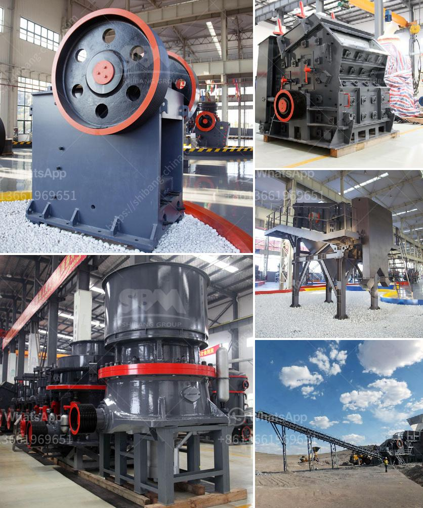

<h3>how much is the mobile mill for small scale mining</h3>
Small-scale mining, particularly artisanal gold mining, has gained significant attention in recent years due to its economic potential and environmental impact. Artisanal miners often work in remote regions where access to traditional milling facilities is limited or non-existent. To address this challenge, a game-changing innovation has emerged known as the mobile mill for small scale mining.

The mobile mill is a portable gold processing unit designed to be easily transported to remote locations, where small-scale miners operate. With a compact design and robust construction, it provides a solution for artisanal miners to process their ore on-site, reducing their reliance on traditional and often environmentally harmful practices.

One of the key advantages of the mobile mill is its modular nature, allowing for easy customization based on the specific needs of the miners. It typically consists of a jaw crusher, a hammer mill, and a centrifugal concentrator, all mounted onto a trailer. The jaw crusher breaks down the larger rocks into smaller sizes, which are then further reduced in size by the hammer mill. Finally, the centrifugal concentrator is used to extract the gold particles from the crushed ore.

The capacity of the mobile mill varies depending on its size and configuration. Some models are capable of processing up to 10 tons of ore per day, while others can handle even larger volumes. This flexibility allows miners to choose a mobile mill that suits their production requirements, thus maximizing efficiency and profitability.

In terms of cost, the price of a mobile mill for small-scale mining ranges from $50,000 to $200,000, depending on the size and configuration. While this initial investment may seem significant, it is important to consider the long-term benefits. By processing their ore on-site, miners can eliminate transportation costs and reduce the risk of theft or loss during transit. Moreover, the mobile mill allows for immediate processing, reducing the need to stockpile ore, which can be both costly and time-consuming.

One of the most significant advantages of the mobile mill is its positive impact on the environment. Artisanal miners often rely on less efficient and potentially harmful practices, such as mercury amalgamation, which poses serious health risks and contributes to water pollution. However, with the mobile mill, miners can utilize gravity separation techniques, minimizing the use of harmful chemicals and promoting environmentally responsible mining practices.

Additionally, the mobile mill has the potential to contribute to the formalization of the artisanal mining sector. By providing miners with a reliable and efficient processing solution, it becomes easier for governments and regulatory bodies to monitor and regulate their activities. This promotes sustainable mining practices, ensuring that communities and the environment are protected.

In conclusion, the mobile mill for small-scale mining represents a significant breakthrough in artisanal gold mining. Its modular design, customization options, and ability to process ore on-site make it a game-changer for remote mining operations. While the initial investment may be substantial, the long-term benefits in terms of efficiency, profitability, and environmental sustainability make it a worthy consideration for artisanal miners globally.
<h3>Contact us</h3><ul><li><strong>Whatsapp:&nbsp;<a href="https://wa.me/8613661969651">+8613661969651</a></strong></li><li><a href="https://swt.shibang-china.com/?git&amp;zhl&amp;how much is the mobile mill for small scale mining"><strong>Online Service(chat now)</strong></a></li></ul><h3>Related</h3><ul><li><a href='quarry business in south africa.md'>quarry business in south africa</a></li><li><a href='concrete stones crushing business plan.md'>concrete stones crushing business plan</a></li><li><a href='stone crusher user manual.md'>stone crusher user manual</a></li><li><a href='screw conveyor for sand.md'>screw conveyor for sand</a></li><li><a href='crushing plant aggregate type.md'>crushing plant aggregate type</a></li></ul>