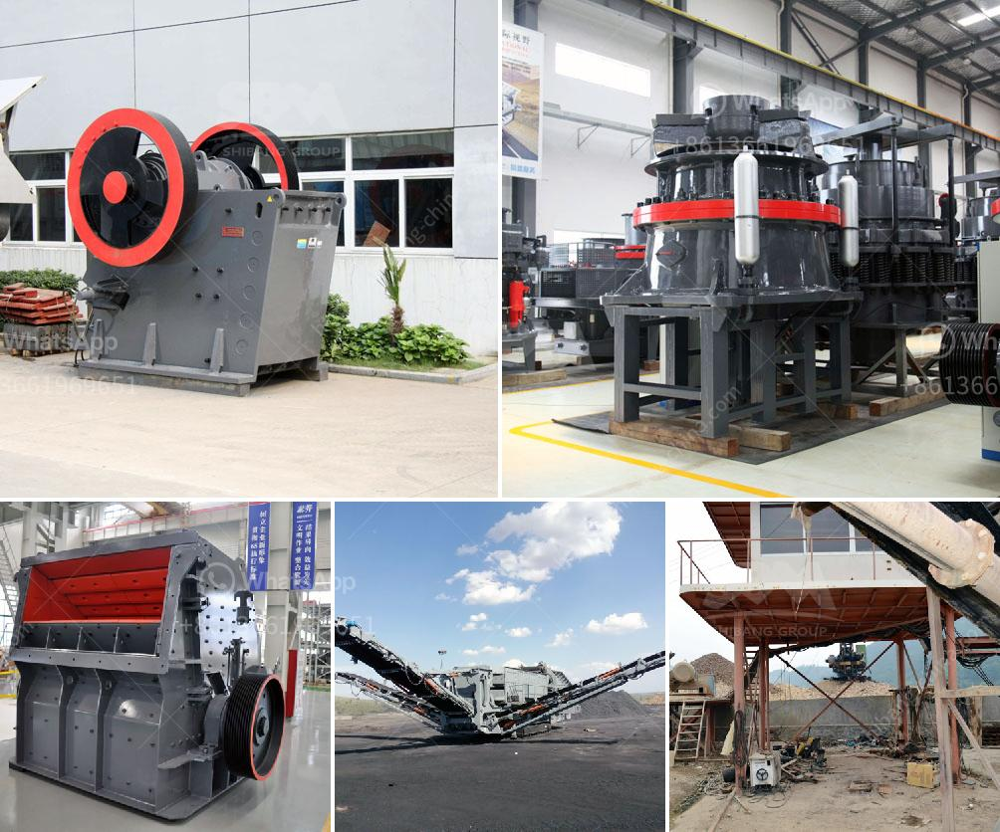

<h3>how much price of ball mill</h3>
The ball mill is a commonly used grinding equipment in the ore beneficiation production line. It is the key equipment for crushing materials after they are crushed. It is widely used in cement, silicate products, new building materials, refractories, fertilizers, black and non-ferrous metal mineral processing and glass ceramics, etc., for dry or wet grinding of various ores and other grindable materials.

The price of ball mills varies from different manufacturers. With the same quality, the price of ball mills provided by different manufacturers may vary by several thousand dollars. Therefore, it is important to compare prices when choosing a ball mill for your project.

There are several factors that affect the price of a ball mill. First, the manufacturing cost. The size, weight, and material of the ball mill will affect its manufacturing cost. A larger and heavier ball mill requires more materials and higher manufacturing costs, so its price will be higher.

Secondly, the production capacity of the ball mill also affects its price. A ball mill with a larger production capacity requires a larger motor power, higher installation cost, and a larger area of land, which will lead to higher investment costs.

Furthermore, the technology and reputation of the manufacturer also play a key role in determining the price of the ball mill. A manufacturer with advanced technology and a good reputation is usually able to provide high-quality equipment, which may come at a higher price. However, the high-quality equipment usually has a longer service life and higher production efficiency, which can bring more benefits to users in the long run.

In addition, the configuration of the ball mill also affects its price. Ball mills can have different configurations, such as wet grinding, dry grinding, and centralized grinding. The price of a ball mill with different configurations may vary. For example, the price of a wet grinding ball mill may be higher than that of a dry grinding ball mill due to different grinding methods.

Lastly, the market demand and competition also have an impact on the price of ball mills. When the market demand is high and the competition is fierce, the price of ball mills may be higher. Conversely, when the market demand is low and there is less competition, the price of ball mills may be lower.

In conclusion, the price of a ball mill can vary greatly depending on factors such as its size, production capacity, technology, reputation, configuration, market demand, and competition. It is important to compare the prices and quality of ball mills from different manufacturers to make an informed decision. Investing in a high-quality and cost-effective ball mill will ultimately bring greater benefits to your project.
<h3>Contact us</h3><ul><li><strong>Whatsapp:&nbsp;<a href="https://wa.me/8613661969651">+8613661969651</a></strong></li><li><a href="https://swt.shibang-china.com/?git&amp;zhl&amp;how much price of ball mill"><strong>Online Service(chat now)</strong></a></li></ul><h3>Related</h3><ul><li><a href='alluvial gold washing plant in zimbabwe.md'>alluvial gold washing plant in zimbabwe</a></li><li><a href='coal crushing machine.md'>coal crushing machine</a></li><li><a href='south africa coal mining cost per ton.md'>south africa coal mining cost per ton</a></li><li><a href='mini mill 12x20 jaw crusher.md'>mini mill 12x20 jaw crusher</a></li><li><a href='beneficiation of iron ore suppliers.md'>beneficiation of iron ore suppliers</a></li></ul>