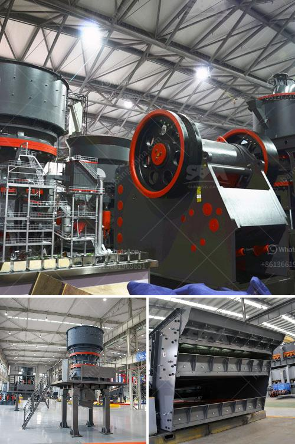

<h3>how to build a hammer mill</h3>
A hammer mill is a machine used to shred or crush materials into smaller pieces. The basic design of this machine involves a rotating shaft, on which free-swinging hammers are mounted. These hammers are available in different sizes and shapes, depending on the material being processed. In this article, we will discuss the steps involved in building a hammer mill.

1. Choose Materials: The first step is to gather the required materials. You will need a strong steel or iron frame to support the internal components of the hammer mill. The materials for the hammers and hammer tips should also be selected carefully, considering the material to be processed.

2. Design the Frame: Design and construct a sturdy frame to ensure the machine's stability and longevity during operation. The frame should be able to withstand the vibrations generated while crushing materials.

3. Fabricate the Hammers: Cut and shape the hammer material into the desired size, ensuring that they are balanced to prevent any unwanted vibrations during operation.

4. Attach the Hammers: Secure the hammers onto the rotating shaft. Make sure they are spaced evenly for uniform crushing of the material. Weld or bolt the hammers in place, ensuring they are securely fastened.

5. Install the Motor: Assemble and mount an electric motor on the frame. This motor will drive the rotating shaft responsible for the hammer's movement.

6. Connect Power: Establish the necessary electrical connections, ensuring the motor is properly wired and connected to a suitable power supply.

7. Test Operation: Once the assembly is complete, test the hammer mill by feeding it with the desired material. Monitor the machine's performance and adjust as needed. Ensure all safety precautions are in place during testing.

Building a hammer mill requires a certain level of mechanical and engineering expertise. It is crucial to understand the principles behind its functioning and follow safety guidelines while constructing the machine. A well-built hammer mill can be a valuable addition to any industrial or agricultural setup, allowing for efficient processing and recycling of various materials.
<h3>Contact us</h3><ul><li><strong>Whatsapp:&nbsp;<a href="https://wa.me/8613661969651">+8613661969651</a></strong></li><li><a href="https://swt.shibang-china.com/?git&amp;zhl&amp;how to build a hammer mill"><strong>Online Service(chat now)</strong></a></li></ul><h3>Related</h3><ul><li><a href='fine powder grinders 30 50 microns.md'>fine powder grinders 30 50 microns</a></li><li><a href='crushed crusher price.md'>crushed crusher price</a></li><li><a href='construction crusher price.md'>construction crusher price</a></li><li><a href='station de concassage daun une carriere.md'>station de concassage daun une carriere</a></li><li><a href='quarry machines manufacturer.md'>quarry machines manufacturer</a></li></ul>