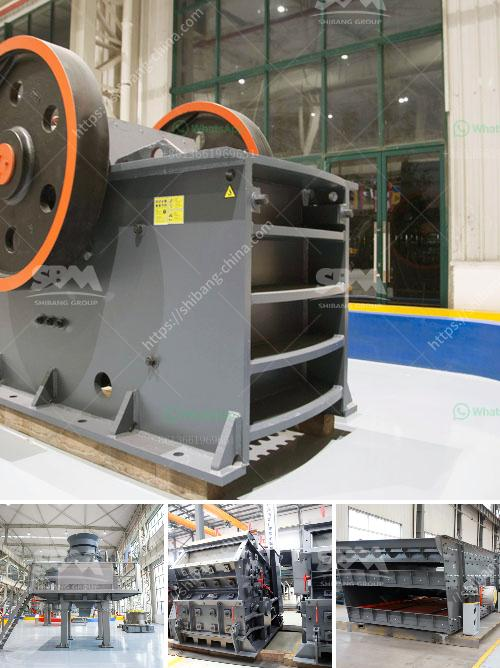

<h3>how to calculate grinding cost</h3>
Grinding is an essential process in many industries, such as manufacturing, construction, and mining. It involves removing material from a workpiece to achieve the desired shape and finish. However, it is important to understand the cost associated with grinding operations, as it can significantly affect a company's bottom line. In this article, we will discuss how to calculate grinding cost to help businesses make informed decisions.

To calculate grinding cost, several factors need to be considered. These include the cost of labor, the cost of abrasive materials, the machine depreciation cost, as well as other indirect costs.

Firstly, the cost of labor should be determined. Labor cost is typically calculated per hour or per unit of time. To calculate it, you need to know the average hourly wage of the grinding machine operator or the total labor cost for a specific period. For example, if the grinding machine operator's hourly wage is $20 and they worked for 8 hours, the labor cost would be $20 x 8 = $160.

Secondly, the cost of abrasive materials should be taken into account. Abrasive materials, such as grinding wheels or belts, wear out over time and need to be replaced. The cost of abrasive materials varies depending on the type, quality, and quantity purchased. To calculate the cost, you need to know the price per unit of the abrasive material and the expected usage. For example, if a grinding wheel costs $10 and lasts for 100 grinding operations, the abrasive cost would be $10 / 100 = $0.1 per grinding operation.

Thirdly, the machine depreciation cost should be considered. Grinding machines and equipment have a limited lifespan and depreciate over time. To calculate the depreciation cost per grinding operation, you need to know the initial cost of the machine and its expected lifespan. For example, if a grinding machine costs $10,000 and is expected to last for 10,000 grinding operations, the depreciation cost would be $10,000 / 10,000 = $1 per grinding operation.

Lastly, indirect costs should be included in the calculation. Indirect costs refer to other expenses associated with grinding operations, such as electricity, maintenance, and overhead costs like rent and insurance. These costs can be allocated per grinding operation based on historical data or estimates.

To calculate the total grinding cost, add up the labor cost, abrasive cost, machine depreciation cost, and indirect costs. For example: 

Suppose the labor cost is $160, the abrasive cost per grinding operation is $0.1, the machine depreciation cost per grinding operation is $1, and the indirect costs amount to $50. 

By calculating the grinding cost, businesses can assess the feasibility and profitability of grinding operations. It helps in determining the pricing strategy, understanding the production costs, and making informed decisions regarding process optimization, machine upgrades, or outsourcing alternatives.

In conclusion, calculating grinding cost involves considering various factors such as labor, abrasive materials, machine depreciation, and indirect costs. By accurately estimating these costs, businesses can make informed decisions and optimize their grinding operations to achieve cost-efficiency and profitability.
<h3>Contact us</h3><ul><li><strong>Whatsapp:&nbsp;<a href="https://wa.me/8613661969651">+8613661969651</a></strong></li><li><a href="https://swt.shibang-china.com/?git&amp;zhl&amp;how to calculate grinding cost"><strong>Online Service(chat now)</strong></a></li></ul><h3>Related</h3><ul><li><a href='calcium carbonate plant manufacturers.md'>calcium carbonate plant manufacturers</a></li><li><a href='quartz production line.md'>quartz production line</a></li><li><a href='artificial sand making in karnataka.md'>artificial sand making in karnataka</a></li><li><a href='mineral materials crusher.md'>mineral materials crusher</a></li><li><a href='stone crusher plant ton per hour.md'>stone crusher plant ton per hour</a></li></ul>