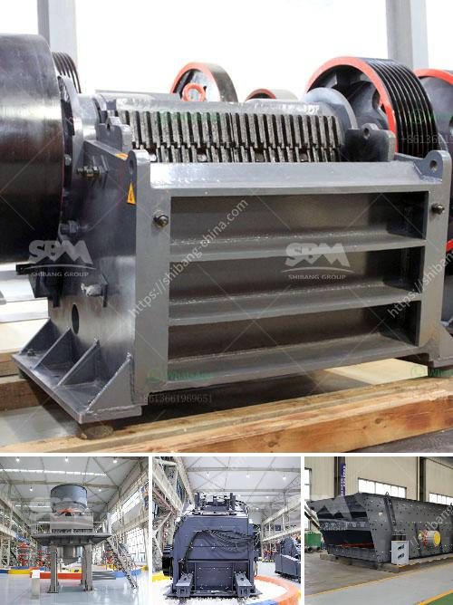

<h3>how to design surge bin hopper crusher</h3>
A surge bin, hopper, and crusher are essential components in any crushing and screening plant. They are used to store and regulate materials that are often required for downstream processes. As a result, these components must be designed with care and precision. In this article, we will discuss the essential factors to consider when designing a surge bin, hopper, and crusher.

First and foremost, it is imperative to understand the flow of materials and their characteristics. Different materials have distinct properties such as size, density, moisture content, and abrasiveness. It is crucial to analyze and evaluate these characteristics to determine the appropriate design parameters. For example, materials with high moisture content may necessitate additional measures to prevent clogging and build-up.

Next, the capacity requirements of the surge bin, hopper, and crusher must be determined. It is essential to estimate the maximum amount of material that will need to be stored and processed within a given time frame. This estimation will allow for the proper sizing of the components and ensure efficient operations. Additionally, consideration should be given to potential future expansions or changes in production requirements.

The design of the surge bin and hopper is equally important as it directly impacts the flow of materials. The shape, size, and orientation of the bin and hopper should facilitate consistent and reliable material flow. Properly designed chutes and gates can help regulate the discharge of materials, minimizing blockages and subsequent downtime. It is recommended to consult with experienced engineers or equipment manufacturers to ensure the optimal design configuration.

Additionally, the surge bin and hopper should be equipped with appropriate level monitoring systems. These systems can range from simple mechanical sensors to advanced technologies such as ultrasonic or laser level transmitters. Level monitoring ensures that the components are adequately filled or emptied, preventing overflow or material starvation.

The selection of the crusher is another critical aspect of the design process. Different crushers have varying capabilities and are suited for different types of materials. It is important to choose a crusher that matches the requirements of the intended application. Factors such as the desired final product size, the feed size distribution, and the required particle shape should be carefully considered.

Furthermore, safety should be a top priority when designing a surge bin, hopper, and crusher. Adequate guarding, fencing, and warning signs should be incorporated into the design to protect personnel from potential hazards. Access points and maintenance areas should be easily and safely accessible to ensure routine inspections and repairs can be conducted efficiently.

Lastly, it is crucial to review and assess the design periodically. The surge bin, hopper, and crusher should be analyzed for any potential inefficiencies, inadequacies, or modifications that may improve performance. Feedback from operators and maintenance personnel can provide valuable insights into areas that may require adjustments.

In conclusion, designing a surge bin, hopper, and crusher requires careful consideration of material characteristics, capacity requirements, and flow dynamics. The proper design configuration, along with efficient level monitoring and crusher selection, is crucial to ensure optimal material processing and plant performance. By following these guidelines, one can design a surge bin, hopper, and crusher that is safe, reliable, and efficient.
<h3>Contact us</h3><ul><li><strong>Whatsapp:&nbsp;<a href="https://wa.me/8613661969651">+8613661969651</a></strong></li><li><a href="https://swt.shibang-china.com/?git&amp;zhl&amp;how to design surge bin hopper crusher"><strong>Online Service(chat now)</strong></a></li></ul><h3>Related</h3><ul><li><a href='clay powder machine.md'>clay powder machine</a></li><li><a href='ball mill for quartz grinding gujarat.md'>ball mill for quartz grinding gujarat</a></li><li><a href='cost to construct a cement factory.md'>cost to construct a cement factory</a></li><li><a href='used clay brick machine for sale in germany.md'>used clay brick machine for sale in germany</a></li><li><a href='how to start a crushing plant.md'>how to start a crushing plant</a></li></ul>