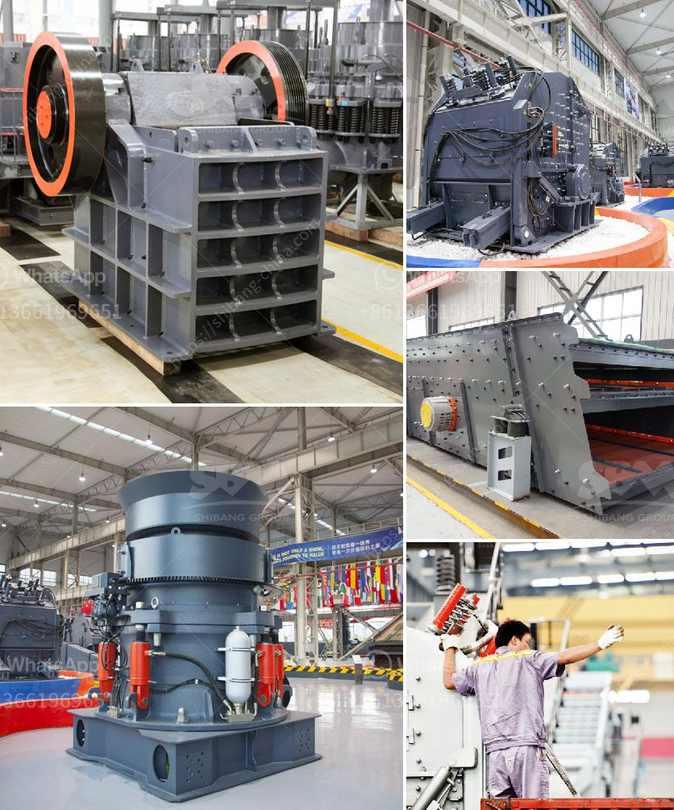

<h3>how to set up a quarry plant</h3>
A quarry plant is a place from which dimension stone, rock, construction aggregate, gravel, or sand is extracted for various uses. This article provides an in-depth guide on how to set up a quarry plant and its possible benefits.

Before setting up a quarry plant, it is important to understand the process of Quarrying. The extraction of rock or minerals from the earth involves a series of crushing and screening stages to produce materials of the desired sizes. These materials can be used for road construction, building foundations, landscaping, or even as raw materials for manufacturing products.

1. Survey the land: This is the first step to determine the availability and suitability of the land for quarrying operations. It is essential to inspect the depth and quality of the materials present in the area. Additionally, an environmental impact assessment should be conducted to ensure compliance with regulations.

2. Obtain permits and licenses: Before commencing operations, it is crucial to obtain the necessary permits and licenses from local authorities. This ensures compliance with legal requirements, which may include environmental approvals and health and safety regulations.

3. Develop a detailed business plan: A well-structured business plan is essential in guiding the quarry plant's operations, including the financial aspect. It helps identify target markets, projected sales, production costs, and potential risks and challenges. Additionally, a business plan is necessary for seeking funding or obtaining support from investors if required.

4. Purchase necessary equipment: Depending on the scale of the quarry plant, various pieces of equipment will be needed, including crushers, screeners, loaders, and trucks. It is important to select equipment that is suitable for the target production capacity and can handle the type of materials being extracted.

5. Hire experienced personnel: Employing qualified individuals who have experience in quarry operations can contribute to the efficient and safe performance of the site. Experienced personnel can handle the machinery, implement safety protocols, and oversee the production process effectively.

6. Promote environmental sustainability: Quarrying can have environmental impacts, so implementing sustainable practices is crucial. This can include measures such as reclamation plans, recycling waste materials, minimizing dust and noise pollution, and utilizing environmentally friendly technologies.

Setting up a quarry plant requires thorough planning and adherence to legal, financial, and environmental considerations. However, when done correctly, it can be a profitable venture that contributes to local infrastructure and development. Successful quarry operations can provide employment opportunities, support local businesses, and also contribute to the overall growth of the economy.
<h3>Contact us</h3><ul><li><strong>Whatsapp:&nbsp;<a href="https://wa.me/8613661969651">+8613661969651</a></strong></li><li><a href="https://swt.shibang-china.com/?git&amp;zhl&amp;how to set up a quarry plant"><strong>Online Service(chat now)</strong></a></li></ul><h3>Related</h3><ul><li><a href='hammer mill dimensions.md'>hammer mill dimensions</a></li><li><a href='vertical grinding mill types for cement plants.md'>vertical grinding mill types for cement plants</a></li><li><a href='crusher jaw crusher 10 36.md'>crusher jaw crusher 10 36</a></li><li><a href='sand grinding mill japan for sale.md'>sand grinding mill japan for sale</a></li><li><a href='grinding equipment cost estimate.md'>grinding equipment cost estimate</a></li></ul>