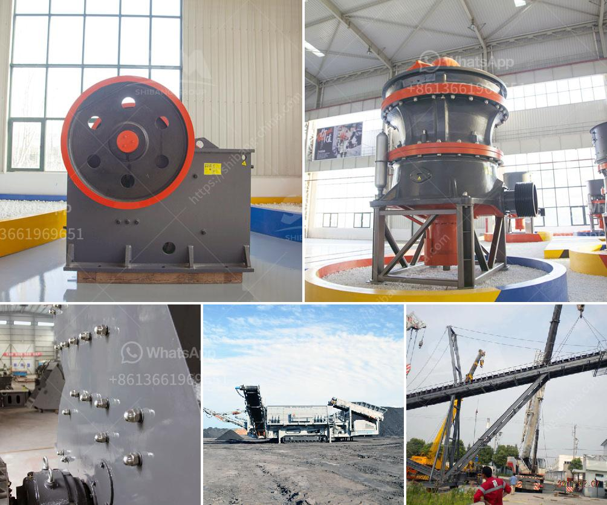

<h3>how to start a crushing plant</h3>
Starting a crushing plant is a critical process that requires careful planning and preparation. The key factors to be considered while setting up a crushing plant are outlined below.

1. Define the purpose of the plant: The first step in starting any project is to clearly define what the plant is intended for. This could be anything from conducting research and analysis to manufacturing products. By defining the purpose, you can determine the equipment, materials, and resources required.

2. Find a suitable location: The location for setting up a crushing plant should ideally be close to the source of raw materials such as stone quarries, construction sites, etc. It helps reduce transportation costs and ensures a steady supply of materials. Moreover, the site should have easy access to infrastructure facilities like roads, water, and electricity supply.

3. Obtain necessary permits and licenses: Before commencing any operation, it is crucial to obtain the necessary permits and licenses required by local and national authorities. This ensures compliance with legal regulations and avoids any legal complications in the future. The permits may include environmental clearances, land-use permits, health and safety certifications, etc.

4. Assess the demand and market potential: Conduct a thorough market research to understand the demand and market potential for the crushed stone. Determine the quantity and quality of stone required by various stakeholders like construction companies, contractors, etc. Analyze the market trends, competitors, pricing, and distribution channels to develop a comprehensive marketing strategy.

5. Purchase the right equipment: Procuring the right equipment is crucial for the success of a crushing plant. Depending on the scale of operations, you may need primary crushers, secondary crushers, conveyors, feeders, scalping screens, tertiary crushers, and vibratory screens. Consult with experts in the field to choose the type and capacity of equipment that suits your specific requirements.

6. Arrange financing: Starting a crushing plant requires significant investment. Explore various financing options like bank loans, venture capital, or partnerships to secure the necessary funds. Prepare a comprehensive business plan, including financial projections and return on investment analysis, to present to potential investors or lenders.

7. Hire skilled labor: A crushing plant requires a team of skilled workers to operate and manage various tasks efficiently. Hire trained and experienced professionals like plant operators, maintenance technicians, and administrative staff. Conduct thorough interviews and background checks to ensure that you have a reliable and competent workforce.

8. Develop a safety plan: Prioritize the safety of workers and equipment by developing a comprehensive safety plan. Educate the workforce about safety protocols, emergency response procedures, and equipment handling techniques. Regularly conducts safety audits and inspections to identify and mitigate potential hazards.

9. Test and optimize the plant: After setting up the crushing plant, conduct tests and trials to ensure smooth operations. Identify any bottlenecks or issues and make necessary modifications to optimize performance. Monitor key performance indicators like production output, energy consumption, maintenance costs, etc., to continuously improve the plant's efficiency.

10. Establish maintenance schedules: Regular maintenance is critical to keep the crushing plant in good working condition. Develop a maintenance schedule that covers routine inspections, lubrication, equipment servicing, and repairs. Keep comprehensive records of maintenance activities and plan for equipment upgrades or replacements as needed.

In conclusion, starting a crushing plant requires careful planning, preparation, and execution. By following the steps mentioned above, you can set up a successful crushing plant that meets the demand and contributes to the growth of your business.
<h3>Contact us</h3><ul><li><strong>Whatsapp:&nbsp;<a href="https://wa.me/8613661969651">+8613661969651</a></strong></li><li><a href="https://swt.shibang-china.com/?git&amp;zhl&amp;how to start a crushing plant"><strong>Online Service(chat now)</strong></a></li></ul><h3>Related</h3><ul><li><a href='copper slag crusher machine manufacturer india.md'>copper slag crusher machine manufacturer india</a></li><li><a href='stone crusher machine pr ice in nepal.md'>stone crusher machine pr ice in nepal</a></li><li><a href='small gold rock crushers with chain.md'>small gold rock crushers with chain</a></li><li><a href='iron crushing machine in mexico.md'>iron crushing machine in mexico</a></li><li><a href='quarry operations business plan.md'>quarry operations business plan</a></li></ul>