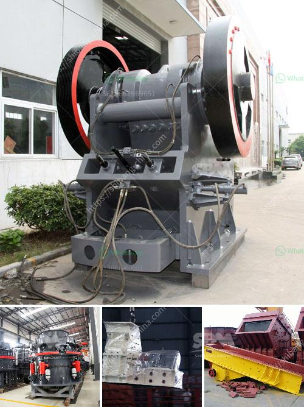

<h3>how to start a quarry business in nigeria</h3>
Starting a quarry business in Nigeria may seem like a daunting task, but it is actually a profitable and rewarding venture. The first step in starting any business is by choosing a niche for your quarry business. You can choose to run a limestone quarry, granite quarry, or a marble quarry.

Once you have chosen a niche, it is important to conduct a feasibility study to determine the viability of the quarry business. This includes analyzing the market demand for your chosen niche, as well as the potential profitability of the business. You will also need to determine the estimated start-up costs involved, such as the cost of land, machinery, equipment, and labor.

Securing a suitable location for your quarry business is crucial. Look for a location that is easily accessible, has a large deposit of the raw materials you want to extract, and is close to major construction sites. You will also need to obtain the necessary permits and licenses from the relevant government authorities to operate legally.

Next, you will need to purchase or lease the necessary equipment and machinery for excavating and processing the raw materials. Depending on the scale of your quarry business, you may need to invest in heavy machinery such as excavators, wheel loaders, crushers, and conveyor belts. Make sure to source reliable suppliers who can provide quality equipment at competitive prices.

Developing a solid business plan is crucial for the success of your quarry business. This will help you outline your goals, strategies, and financial projections for the business. It is essential to have a clear understanding of your target market, the pricing structure of your products, and effective marketing strategies to reach potential customers.

Building a network of reliable suppliers and buyers is essential for the smooth operation of your quarry business. Establishing strong relationships with suppliers will ensure a consistent supply of raw materials, while building partnerships with contractors and builders will help you secure contracts for the sale of your products.

Investing in efficient and sustainable quarrying practices is crucial for long-term success. Ensure that you adhere to environmental regulations and implement measures to minimize the impact of your operations on the surrounding communities and natural resources. This may include implementing water and dust control measures, rehabilitating the land after extraction, and investing in renewable energy sources.

Lastly, marketing and promoting your quarry business is vital for attracting customers. Utilize online platforms and traditional marketing strategies to increase brand awareness and reach a wider audience. Attend industry events and trade shows to network with potential customers and build partnerships with other stakeholders in the construction industry.

Starting a quarry business in Nigeria can be a fulfilling and financially rewarding endeavor. With careful planning, execution, and a strong commitment to excellence, you can establish a successful quarry business in Nigeria that will contribute to the growth and development of the construction industry.
<h3>Contact us</h3><ul><li><strong>Whatsapp:&nbsp;<a href="https://wa.me/8613661969651">+8613661969651</a></strong></li><li><a href="https://swt.shibang-china.com/?git&amp;zhl&amp;how to start a quarry business in nigeria"><strong>Online Service(chat now)</strong></a></li></ul><h3>Related</h3><ul><li><a href='precipitated calcium carbonate milling.md'>precipitated calcium carbonate milling</a></li><li><a href='roller mill for dolmite.md'>roller mill for dolmite</a></li><li><a href='manganese ore beneficiation plant china.md'>manganese ore beneficiation plant china</a></li><li><a href='grinding machine made in turkey.md'>grinding machine made in turkey</a></li><li><a href='industrial aluminum can crusher in saudi arabia.md'>industrial aluminum can crusher in saudi arabia</a></li></ul>