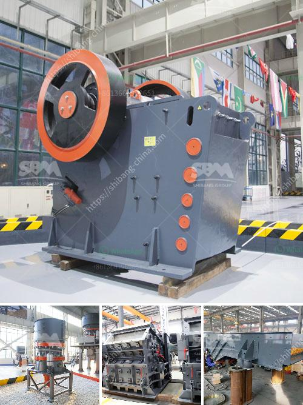

<h3>hp 400 cone crusher</h3>
The HP 400 cone crusher is synonymous with the name "HP" and exemplifies the company's commitment to providing advanced technological expertise and top-notch manufacturing. Boasting a range of versatile features, the cone crusher is an efficient and reliable machine that is capable of handling any mining or construction project.

One of the key components of the HP 400 cone crusher is its low maintenance design. With automated features and a push button control system, operators can easily set up the machine and adjust its settings for optimal performance. This allows for increased productivity and reduces downtime, as operators can quickly make adjustments on the fly.

Another notable feature of the HP 400 cone crusher is its energy efficiency. The machine is designed to conserve energy by reducing friction and heat loss. This not only saves money on operating costs, but also makes the machine more environmentally friendly. With the increasing emphasis on sustainability in the mining and construction industries, the HP 400 cone crusher is a smart choice for any company looking to reduce its carbon footprint.

Durability is also a standout characteristic of the HP 400 cone crusher. Built with high-quality materials, the machine is able to withstand the toughest conditions and offer long-lasting performance. This is especially important in mining and construction projects, where equipment is constantly subjected to heavy loads and abrasive material. The HP 400 cone crusher ensures minimal downtime, reducing the need for costly repairs and replacements.

In terms of performance, the HP 400 cone crusher delivers outstanding results. Its advanced technological features, such as the IC70C™ automation system, ensure a consistent and precise product size, even in the most challenging applications. Additionally, the cone crusher's larger feed opening and higher power capabilities can process more material at a faster rate, increasing overall efficiency and productivity.

Furthermore, the HP 400 cone crusher comes with a variety of optional features that can be customized to meet specific customer requirements. These include anti-spin technology, hydraulic setting adjustment, and wear compensation. These additional features further enhance the machine's capabilities, making it adaptable to a wide range of tasks.

In summary, the HP 400 cone crusher is a reliable, versatile, and efficient machine that will meet all your crushing needs. With its low maintenance design, energy-efficient features, and durable construction, the cone crusher ensures a high level of performance and productivity. Whether you are in the mining or construction industry, the HP 400 cone crusher is a must-have for any operation looking to optimize its crushing capabilities.
<h3>Contact us</h3><ul><li><strong>Whatsapp:&nbsp;<a href="https://wa.me/8613661969651">+8613661969651</a></strong></li><li><a href="https://swt.shibang-china.com/?git&amp;zhl&amp;hp 400 cone crusher"><strong>Online Service(chat now)</strong></a></li></ul><h3>Related</h3><ul><li><a href='ball mill operation cost.md'>ball mill operation cost</a></li><li><a href='coal crusher and screen plant for sale.md'>coal crusher and screen plant for sale</a></li><li><a href='quartz making machine germany.md'>quartz making machine germany</a></li><li><a href='iron ore crushers.md'>iron ore crushers</a></li><li><a href='simple stone crusher dubai.md'>simple stone crusher dubai</a></li></ul>