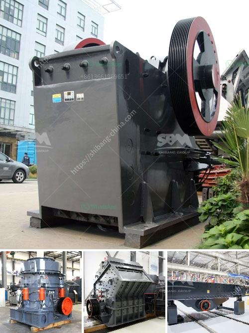

<h3>hydrated lime machine</h3>
Hydrated lime machines play a crucial role in various industries that require the production of hydrated lime, a versatile chemical compound with numerous applications. These machines are designed to efficiently and effectively produce hydrated lime from raw materials such as limestone, dolomite, or quicklime.

The process of producing hydrated lime involves adding water to quicklime (calcium oxide), resulting in a chemical reaction that produces calcium hydroxide. This compound is widely used in industries such as agriculture, construction, chemical, and environmental.

One of the main advantages of using a hydrated lime machine is its ability to ensure consistent and high-quality production. These machines are equipped with advanced technologies that regulate the water addition and mixing process to achieve the desired level of hydration. This ensures that the final product meets the required industry standards and specifications.

Another key benefit of using a hydrated lime machine is its versatility and flexibility. These machines are capable of handling a wide range of raw materials and can be adjusted to produce different grades of hydrated lime. This allows industries to cater to their specific needs and requirements.

Furthermore, hydrated lime machines are designed to maximize efficiency and minimize energy consumption. They are equipped with features such as automatic control systems and energy-saving mechanisms that optimize the production process. This not only helps businesses to reduce operational costs but also promotes eco-friendly practices.

In conclusion, hydrated lime machines are essential in industries that require the production of hydrated lime. They offer numerous advantages, including consistent and high-quality production, versatility, and energy efficiency. Investing in a reliable and efficient hydrated lime machine can greatly benefit businesses by improving their productivity and enhancing the quality of their products.
<h3>Contact us</h3><ul><li><strong>Whatsapp:&nbsp;<a href="https://wa.me/8613661969651">+8613661969651</a></strong></li><li><a href="https://swt.shibang-china.com/?git&amp;zhl&amp;hydrated lime machine"><strong>Online Service(chat now)</strong></a></li></ul><h3>Related</h3><ul><li><a href='marble stone milling plant.md'>marble stone milling plant</a></li><li><a href='cost of mobile coal crusher.md'>cost of mobile coal crusher</a></li><li><a href='roll grinders manufacturers.md'>roll grinders manufacturers</a></li><li><a href='clinker grinding plant manufacturers germany.md'>clinker grinding plant manufacturers germany</a></li><li><a href='price of ball mill for sale.md'>price of ball mill for sale</a></li></ul>