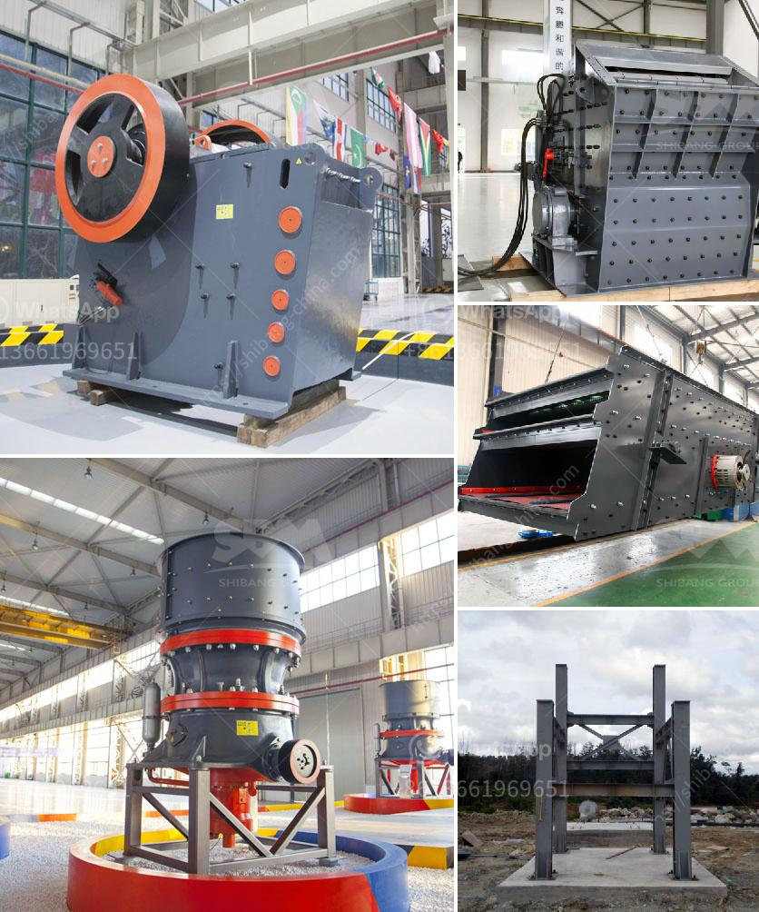

<h3>impact crusher from china</h3>
Impact crusher is a widely used crusher in China which is applied to crush materials with a size of 500mm and a compressive strength not more than 350MPa. The Impact Crusher has immovable hammer and disc-shaped hammer. Additionally, it has large crushing ratio, high crushing efficiency, simple structure and low cost. As a result, it is often applied in metallurgy, chemical industry, building materials, water conservancy and other industries.

The Impact Crusher is mainly composed of rotor, impact plate, impact rack, hammer, side liner plate, feeder opening, bushing, adjusting device and discharging port. Besides, it adopts a heavy-duty rotor design, which improves the reliability and stability of the machine over time.

a) High Crushing Efficiency: The Impact Crusher has a high crushing ratio of 10 to 25. It can quickly crush materials to the required particle size and discharge them from the outlet, thus reducing secondary crushing costs and saving energy.

b) Wide Range of Applications: The Impact Crusher can process various materials with a particle size of 100-500mm and a compressive strength of up to 350MPa. It is suitable for crushing medium-hard materials such as limestone, slag, coke, coal and other materials in cement plants, power plants, chemical plants and other industries.

c) Adjustable Discharging Size: The Impact Crusher has an adjustable discharging size, which can flexibly control the size of the crushed materials according to the customer's requirements. This feature makes it suitable for various crushing needs.

d) Simple Structure and Easy Maintenance: The Impact Crusher has a simple structure, small size, and lightweight design, making it easy to install, operate and maintain. The user can adjust the gap between the impact rack and rotor to change the discharging granularity and shape of the materials.

a) Aggregate Production: The Impact Crusher is widely used in the production of high-quality aggregates for the construction industry. It can produce cubic-shaped or round-shaped aggregates from limestone, granite, basalt, river pebbles and other materials.

b) Ore Crushing: The Impact Crusher plays an important role in the crushing of various ores, including gold ore, copper ore, iron ore, lead-zinc ore, etc. It is widely used in the mining industry and is favored for its high efficiency and low operating cost.

c) Construction Waste Recycling: The Impact Crusher can effectively process construction waste and turn it into recycled aggregates. This significantly reduces the amount of construction waste going to landfills and contributes to environmental protection.

d) Building Materials Industry: The Impact Crusher can be used to crush various building materials, such as concrete, bricks, ceramic tiles, etc., for recycling or reusing in construction projects.

In conclusion, the Impact Crusher from China is a versatile and cost-effective crusher that has a wide range of applications in various industries. Its high crushing efficiency, adjustable discharging size, and simple structure make it a popular choice among customers. Whether used in aggregate production, ore crushing, construction waste recycling, or other applications, the Impact Crusher can effectively reduce costs and contribute to sustainable development.
<h3>Contact us</h3><ul><li><strong>Whatsapp:&nbsp;<a href="https://wa.me/8613661969651">+8613661969651</a></strong></li><li><a href="https://swt.shibang-china.com/?git&amp;zhl&amp;impact crusher from china"><strong>Online Service(chat now)</strong></a></li></ul><h3>Related</h3><ul><li><a href='stone crusher portable machine.md'>stone crusher portable machine</a></li><li><a href='conveyor belt supplies south africa.md'>conveyor belt supplies south africa</a></li><li><a href='small gold crushing plant for sale.md'>small gold crushing plant for sale</a></li><li><a href='stone crusher youtube.md'>stone crusher youtube</a></li><li><a href='stone crusher line.md'>stone crusher line</a></li></ul>