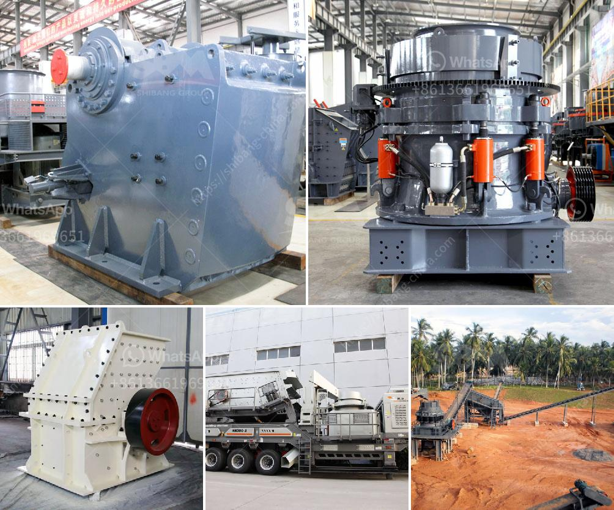

<h3>impact crusher hammer mill</h3>
The impact crusher hammer mill is a crucial equipment in mining industry and industrial processing. It is used to crush and pulverize materials such as limestone, sand, gravel, asphalt, cement rock, and many types of minerals. This machine is simple and reliable, providing safe and efficient operation. 

The hammer mill operates by high-speed rotating hammer and material collision. It grinds material by the hammer's rotating with high speed and crushing them into smaller size. This process allows the equipment to reduce large rocks into smaller particles which can be further processed or used as construction materials.

One of the advantages of the impact crusher hammer mill is its versatility. It can crush a wide variety of materials, including soft materials like limestone and hard materials like granite. This makes it ideal for use in diverse applications, such as construction, mining, and road building. It can also be used to process materials for industries like cement, chemical, and metallurgy.

Another advantage of the impact crusher hammer mill is its high efficiency. The machine is designed to efficiently crush and pulverize materials, reducing the need for multiple passes through other equipment. This saves time and energy, making the hammer mill a cost-effective option for various industries.

Additionally, the impact crusher hammer mill is designed with safety features to ensure the operator's wellbeing. It includes features like a safety cover, emergency stop button, and overload protection. These features prevent accidents and protect the user from injury during operation.

In conclusion, the impact crusher hammer mill is a versatile and efficient machine for crushing and pulverizing materials. Its ability to crush a wide variety of materials and its high efficiency make it an ideal choice for many industries. With its safety features, it ensures the operator's safety during operation. Whether in construction, mining, or other industries, the impact crusher hammer mill is a valuable tool for material processing.
<h3>Contact us</h3><ul><li><strong>Whatsapp:&nbsp;<a href="https://wa.me/8613661969651">+8613661969651</a></strong></li><li><a href="https://swt.shibang-china.com/?git&amp;zhl&amp;impact crusher hammer mill"><strong>Online Service(chat now)</strong></a></li></ul><h3>Related</h3><ul><li><a href='gold washing plant tons per hour.md'>gold washing plant tons per hour</a></li><li><a href='difference between vsi and hsi.md'>difference between vsi and hsi</a></li><li><a href='crushers of germany.md'>crushers of germany</a></li><li><a href='rock jaw crusher.md'>rock jaw crusher</a></li><li><a href='iron ore to iron process made in canada.md'>iron ore to iron process made in canada</a></li></ul>