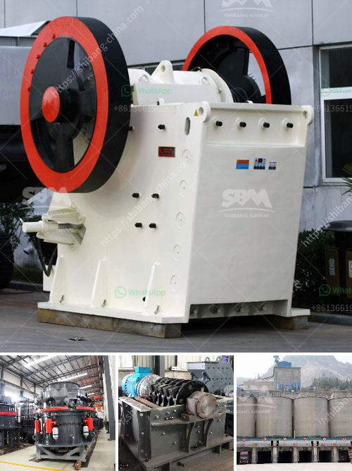

<h3>impact crusher manufacturers china</h3>
China is the world's largest producer and exporter of impact crushers, with many reputable manufacturers located within its borders. As more and more countries around the world embrace the concept of sustainable development, the demand for premium quality impact crushers is set to rise. These machines play a crucial role in various industries, including mining, construction, and recycling.

One of the key advantages of choosing an impact crusher manufactured in China is the broad range of products available. With such a wide range of options available, it is easier than ever to find the optimal machine for your specific requirements. Whether you are in need of a primary impact crusher, secondary crusher, or tertiary impact crusher, you can rely on the expertise of China manufacturers to deliver a high-quality product with outstanding performance.

To ensure that customers get the best impact crushers at competitive prices, China manufacturers invest great efforts in research and development. They work closely with customers to understand their needs and then develop innovative solutions to meet those requirements. Many Chinese manufacturers follow stringent quality control measures to ensure that their impact crushers meet international standards.

China manufacturers also offer comprehensive after-sales support, including installation, training, and maintenance services. This ensures that customers can use their impact crushers effectively and efficiently for years to come. In addition, China manufacturers often provide spare parts and technical support, making it convenient for customers to get replacements and resolve any issues that may arise.

Another significant advantage of choosing impact crusher manufacturers in China is the cost-effectiveness. Chinese manufacturers are known for their competitive pricing strategies, offering quality products at relatively affordable prices. This allows customers to obtain efficient and reliable impact crushers at a favorable cost.

In conclusion, opting for impact crusher manufacturers in China is a wise choice if you want to expand your business and contribute to sustainable development. These manufacturers offer a wide range of impact crushers tailored to your specific needs, backed by comprehensive after-sales support. Their commitment to innovation, quality, and cost-effectiveness makes them highly competitive in the global market.
<h3>Contact us</h3><ul><li><strong>Whatsapp:&nbsp;<a href="https://wa.me/8613661969651">+8613661969651</a></strong></li><li><a href="https://swt.shibang-china.com/?git&amp;zhl&amp;impact crusher manufacturers china"><strong>Online Service(chat now)</strong></a></li></ul><h3>Related</h3><ul><li><a href='trommel screen sale australia.md'>trommel screen sale australia</a></li><li><a href='quarry crusher plant location in malaysia.md'>quarry crusher plant location in malaysia</a></li><li><a href='chelyabinsk crushers price.md'>chelyabinsk crushers price</a></li><li><a href='mobile crusher 100tph for sale.md'>mobile crusher 100tph for sale</a></li><li><a href='the cost of stone crusher in pakistan.md'>the cost of stone crusher in pakistan</a></li></ul>