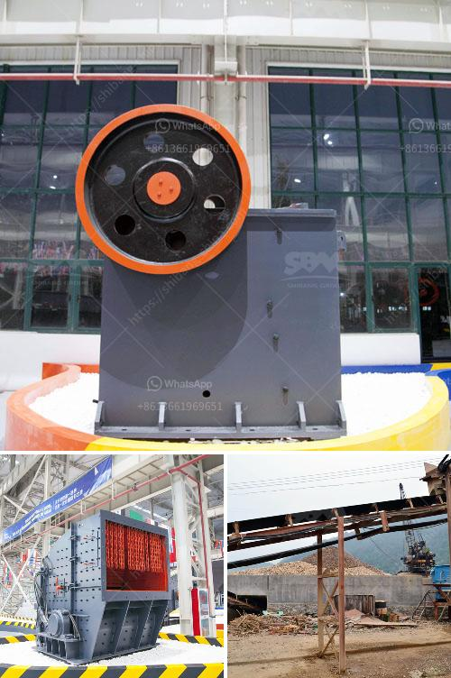

<h3>impact crusher zenith</h3>
In today's fast-paced world, industries require simple, efficient, and cost-effective solutions for crushing a variety of materials. The Impact Crusher Zenith has been developed to meet these demands. With its ability to simplify particle size reduction and improve productivity, this machine is revolutionizing the way we process materials.

One of the key features of the Impact Crusher Zenith is its versatility. It can handle a wide range of materials, including limestone, concrete, ores, minerals, coal, and even hard rock. This adaptability makes it an ideal choice for various industries, such as construction, mining, and recycling.

The Impact Crusher Zenith operates on the principle of impact crushing. This process involves the use of a rotor that rapidly rotates at high speeds, delivering a powerful blow to the incoming feed material. As a result, the material is shattered, creating smaller particles that can be further processed or used as desired.

What sets the Impact Crusher Zenith apart from other crushing machines is its unique design. The rotor is equipped with fixed blow bars that effectively break down the material upon impact. Additionally, the high-speed rotation of the rotor ensures efficient crushing, reducing both operating costs and energy consumption.

The Impact Crusher Zenith also incorporates advanced technology to optimize performance and increase productivity. It features an adjustable gap mechanism that allows the user to control the output size of the crushed material. This ensures that the desired particle size requirements are met, resulting in products of consistent quality.

Furthermore, the Impact Crusher Zenith is equipped with a hydraulic system that provides easy accessibility for maintenance purposes. The hydraulic opening mechanism allows for quick and convenient access to the rotor and blow bars, simplifying the replacement process and minimizing downtime. This feature is especially beneficial in industries operating under tight production schedules.

Another noteworthy aspect of the Impact Crusher Zenith is its high level of safety. The machine is equipped with several safety features, including a self-locking device that prevents the rotor from turning when the front door is open. Additionally, the crusher is fitted with safety guards and warning signs to ensure the operator's well-being during operation.

In conclusion, the Impact Crusher Zenith is a game-changer in the way we process materials. Its versatility, efficiency, and advanced features make it an essential tool for a wide range of industries. Whether it is crushing limestone for road construction or recycling concrete for sustainable development, this machine provides a reliable and cost-effective solution. With ongoing technological advancements and a commitment to quality, Zenith is transforming the way we process materials, one impact at a time.
<h3>Contact us</h3><ul><li><strong>Whatsapp:&nbsp;<a href="https://wa.me/8613661969651">+8613661969651</a></strong></li><li><a href="https://swt.shibang-china.com/?git&amp;zhl&amp;impact crusher zenith"><strong>Online Service(chat now)</strong></a></li></ul><h3>Related</h3><ul><li><a href='hammer mills for sale in zimbabwe.md'>hammer mills for sale in zimbabwe</a></li><li><a href='crusher machine quarry crusher.md'>crusher machine quarry crusher</a></li><li><a href='portable crushers sweden.md'>portable crushers sweden</a></li><li><a href='stone crusher flow chart.md'>stone crusher flow chart</a></li><li><a href='roller mill in india.md'>roller mill in india</a></li></ul>