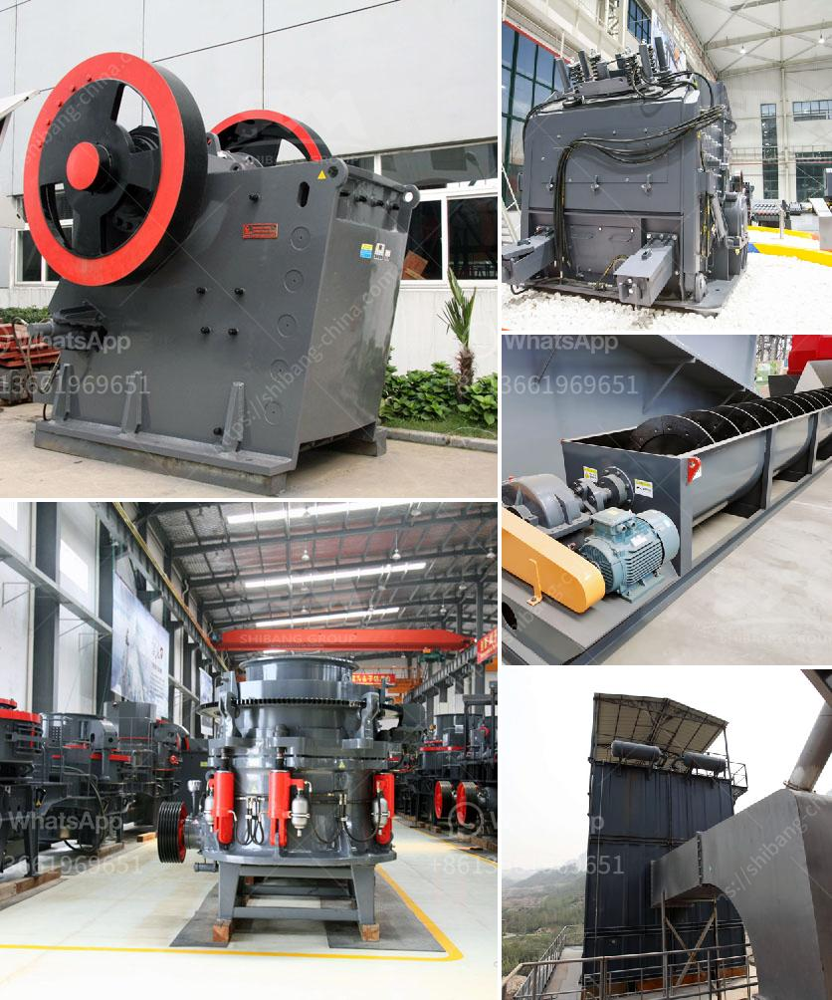

<h3>impact crushers turkey</h3>
Impact crushers are increasingly being used in many industries around the world, including Turkey. These machines offer a host of benefits when compared to traditional crushing methods, such as reducing downtime, improving efficiency, and increasing productivity.

One of the main advantages of impact crushers is their ability to handle a wide range of materials. Whether it's limestone, concrete, or even reinforced concrete, these machines can effortlessly crush it into smaller, manageable sizes. This versatility allows industries across Turkey to use impact crushers for various applications, including construction, mining, and recycling.

Another key feature of impact crushers is their efficient operation. With advanced technology and innovative design, these machines ensure maximum performance with minimal energy consumption. This not only helps businesses in Turkey save on energy costs but also reduces their carbon footprint, making impact crushers an environmentally friendly choice.

In addition to efficiency, impact crushers also offer improved safety features. Many models come with advanced automation and safety systems that protect both operators and the machine itself. This minimizes the risk of accidents and increases the overall operational reliability of the crusher.

Moreover, impact crushers in Turkey are highly versatile and can be customized according to specific requirements. The machines can be equipped with different rotors, blow bars, and liners to suit the desired application. This flexibility allows businesses to optimize their crushing processes and achieve the desired end product.

Overall, impact crushers have had a significant impact on the Turkish industrial sector. By combining efficiency, versatility, and safety, these machines have revolutionized the way materials are crushed and processed. Whether it's in construction, mining, or recycling, impact crushers play a crucial role in helping Turkish businesses streamline their operations and increase profitability.
<h3>Contact us</h3><ul><li><strong>Whatsapp:&nbsp;<a href="https://wa.me/8613661969651">+8613661969651</a></strong></li><li><a href="https://swt.shibang-china.com/?git&amp;zhl&amp;impact crushers turkey"><strong>Online Service(chat now)</strong></a></li></ul><h3>Related</h3><ul><li><a href='quarry machines manufacturer.md'>quarry machines manufacturer</a></li><li><a href='grinding media charge calculation in cement ball mills.md'>grinding media charge calculation in cement ball mills</a></li><li><a href='silica crusher plant in the philippines.md'>silica crusher plant in the philippines</a></li><li><a href='mini coke processing plant.md'>mini coke processing plant</a></li><li><a href='limestone grinding process.md'>limestone grinding process</a></li></ul>