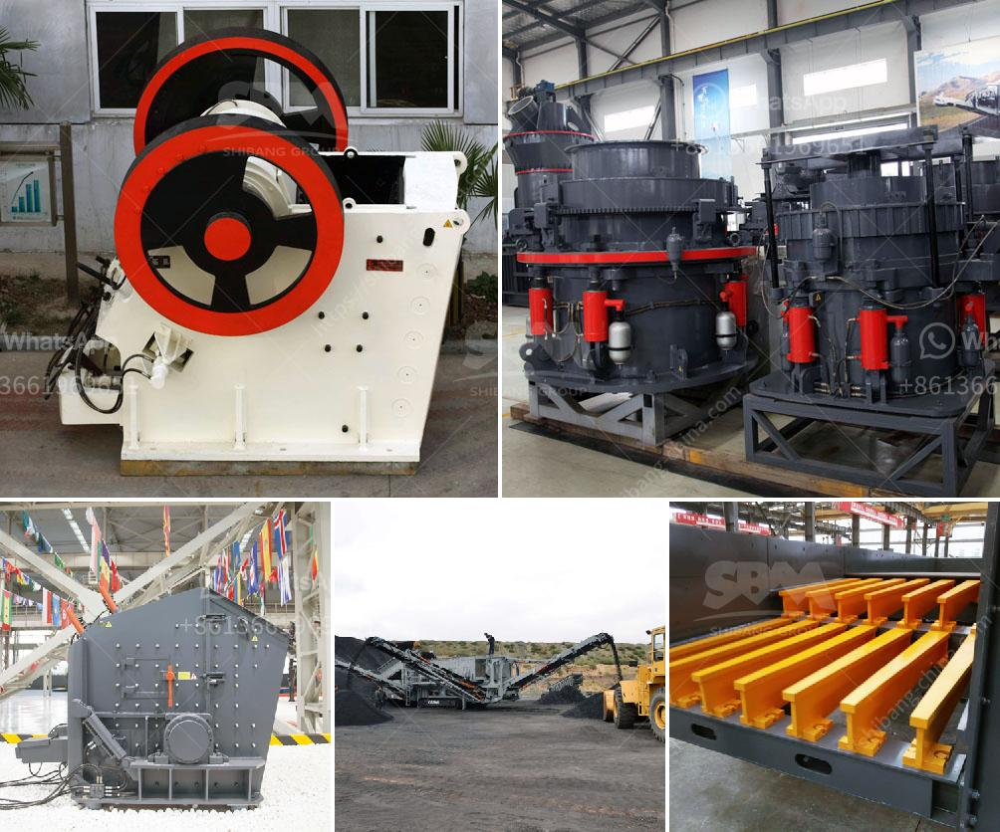

<h3>impact crushing machine manufacturer</h3>
In the world of construction and mining, industries rely heavily on crushing equipment to break down large rocks, ores, and other materials into smaller pieces. One crucial machine that plays a significant role in these tasks is the impact crushing machine. This machine utilizes the principle of impact to reduce the size of materials and is widely used in various applications, ranging from quarrying and construction to recycling.

When it comes to impact crushing machines, the choice of a reliable and reputable manufacturer is imperative. Among the manufacturers that have made a significant impact on the industry is [Manufacturer's Name]. With years of experience and expertise, they have established themselves as a leading provider of high-quality impact crushing machines.

One key aspect that sets [Manufacturer's Name] apart from the competition is their commitment to efficiency. Their machines are designed with advanced features to ensure optimal productivity. The innovative design, coupled with powerful motors, enables these machines to handle large volumes of materials with ease. This efficiency translates into time and cost savings for the operators, making [Manufacturer's Name] machines highly sought after.

Versatility is another area where [Manufacturer's Name] excels. They offer a wide range of impact crushing machines that cater to various crushing applications. Whether it's primary crushing, secondary crushing, or tertiary crushing, they have a machine suitable for every stage of the process. Furthermore, these machines can process different types of materials, including limestone, granite, concrete, and asphalt, making them versatile options for diverse projects.

Another crucial factor that makes [Manufacturer's Name] a preferred choice is their emphasis on durability and reliability. Their machines are built to withstand the harsh conditions of construction and mining sites, ensuring long-lasting performance. High-quality materials and robust construction techniques are employed during the manufacturing process to ensure the machines can withstand the rigors of heavy-duty applications.

Apart from the quality of the machines, [Manufacturer's Name] is also known for their exceptional after-sales support and customer service. They understand the importance of providing prompt assistance and technical guidance to their clients. Whether it's troubleshooting, maintenance, or spare parts, their dedicated team is always ready to assist, ensuring minimal downtime for their customers.

In conclusion, impact crushing machines have revolutionized the crushing industry by providing efficient and versatile solutions for various applications. Among the manufacturers that have made a significant impact in this field, [Manufacturer's Name] stands out for their commitment to efficiency, versatility, durability, and exceptional customer service. Their machines not only offer superior performance but also contribute to cost savings and increased productivity. So, if you're in need of a reliable impact crushing machine, [Manufacturer's Name] should be on your top list.
<h3>Contact us</h3><ul><li><strong>Whatsapp:&nbsp;<a href="https://wa.me/8613661969651">+8613661969651</a></strong></li><li><a href="https://swt.shibang-china.com/?git&amp;zhl&amp;impact crushing machine manufacturer"><strong>Online Service(chat now)</strong></a></li></ul><h3>Related</h3><ul><li><a href='gold plant for sale philippines.md'>gold plant for sale philippines</a></li><li><a href='mini lava rock crusher for homeowner.md'>mini lava rock crusher for homeowner</a></li><li><a href='business plan for small scale chrome mining.md'>business plan for small scale chrome mining</a></li><li><a href='machine that crushes stones to ballast.md'>machine that crushes stones to ballast</a></li><li><a href='coal crushing and screening plant for sale.md'>coal crushing and screening plant for sale</a></li></ul>