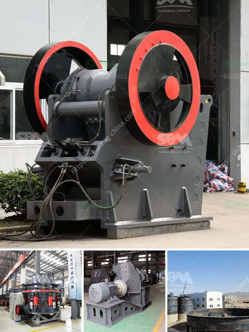

<h3>impact of fator on coal crusher</h3>
Coal crusher, also known as coal crushing plant, is the coal mining equipment designed for coal crushing process in energy industry. As the Moshs Hardness of coal is usually under 5, Daswell design coal crusher, which is wit enough to process the raw materials with the hardness under 350Mpa, to handle all kinds of coal from hard coal, woody lignite coal to anthracite coal and petroleum coke.

When it comes to the impact of fator on coal crusher, there are multiple aspects that need to be considered. One of the key factors is the type of coal being crushed. Different types of coal have different physical and chemical properties, which can affect the efficiency and effectiveness of the crushing process. Some coals are more brittle, while others are more ductile. This can influence the energy required to fracture the coal particles and the resulting particle size distribution.

Another important factor is the moisture content of the coal. Moisture can significantly affect the performance of a coal crusher. Wet coal tends to clog the crusher and decrease its throughput, leading to an inefficient and ineffective crushing process. It can also cause problems downstream in the handling and processing of the crushed coal. Therefore, it is crucial to properly dry the coal before crushing it.

In addition, the feed size of the coal also impacts its crushing efficiency. Larger feed sizes require more energy and result in larger product sizes, while smaller feed sizes can be crushed more easily, leading to a finer product. The optimal feed size for a coal crusher depends on the specific requirements of the coal-fired power plant or coal processing plant.

Furthermore, the design and construction of the coal crusher also play a significant role in its performance. A well-designed crusher should be able to handle the specific requirements of the coal and provide reliable and efficient crushing. The size, shape, and arrangement of the crushing elements, such as hammers or blades, can impact the particle size distribution and energy consumption.

To ensure optimal performance and minimize downtime, regular maintenance and inspection of the coal crusher are essential. This includes checking for wear and tear on the crushing elements, inspecting the drive system, and monitoring the overall condition of the crusher. Early detection of any issues can prevent costly breakdowns and prolong the lifespan of the crusher.

In conclusion, the impact of fator on coal crusher is multifaceted and requires careful consideration. The type of coal, moisture content, feed size, and design of the crusher all contribute to its performance. Adequate maintenance and inspection are also crucial for ensuring optimal crushing efficiency. By taking these factors into account, coal-fired power plants and coal processing plants can maximize their productivity and minimize downtime.
<h3>Contact us</h3><ul><li><strong>Whatsapp:&nbsp;<a href="https://wa.me/8613661969651">+8613661969651</a></strong></li><li><a href="https://swt.shibang-china.com/?git&amp;zhl&amp;impact of fator on coal crusher"><strong>Online Service(chat now)</strong></a></li></ul><h3>Related</h3><ul><li><a href='portable crusher plant.md'>portable crusher plant</a></li><li><a href='primary stone crusher for rent in karnataka.md'>primary stone crusher for rent in karnataka</a></li><li><a href='cement manufacturing process flow chart.md'>cement manufacturing process flow chart</a></li><li><a href='hammer mill prices south africa.md'>hammer mill prices south africa</a></li><li><a href='screens hammer mills.md'>screens hammer mills</a></li></ul>