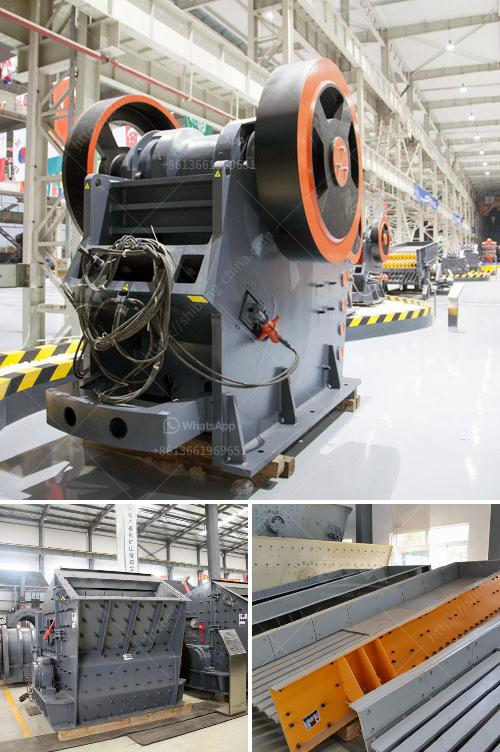

<h3>impact stone crusher</h3>
Impact stone crusher is used with soft materials, medium to hard stones and medium hard metallic ores. The principles used for impact loading is the time for the natural frequency of the body is much greater than with the time for applying force on materials. Since the hammer is rotating at a very high speed, the time for which the particles come in contact with the hammer is very small, hence impact loading is applied. The impact crusher is widely used in metallurgy, mining, road construction, chemical industry and other industries.

But how have impact crushers reached the wear parameters of cone crushers? In the past, the use of impact crushing for hard and abrasive stone was mostly limited to very small niche markets, especially in countries such as Spain and Germany. It was in markets such as these that the impact crusher evolved and matured for 50 years to become the trusted product it is today.

Whether a quarry produces high-quality aggregates or industrial minerals, the gradation of these materials is at least as important as availability of the reserves. The production of high-quality end products entails two actions: Firstly, the application of a minimum of energy to break rocks; and secondly, through careful production line design, eliminating waste and guaranteeing high-quality products.

The impact stone crusher comes with a feeder along with a conveyor appropriate towards the crusher thickness to match efficient crushing work. Impact Stone Crushing Machine Nigeria Crushers are one of the major size reduction equipment that is used in metallurgical, mechanical, and other similar industries. They exist in various sizes and capacities which range from 0.1 ton/hr. to 50 ton/hr. They can be classified based on the degree to which they can fragment the starting material and the way they apply forces.

Based on the mechanism used crushers are basically of three types; namely, Cone crusher, Jaw crusher and Impact crusher. The main objective is to design impact stone crusher.
<h3>Contact us</h3><ul><li><strong>Whatsapp:&nbsp;<a href="https://wa.me/8613661969651">+8613661969651</a></strong></li><li><a href="https://swt.shibang-china.com/?git&amp;zhl&amp;impact stone crusher"><strong>Online Service(chat now)</strong></a></li></ul><h3>Related</h3><ul><li><a href='germany stone crushing plants.md'>germany stone crushing plants</a></li><li><a href='magnetic separator for iron sand.md'>magnetic separator for iron sand</a></li><li><a href='rock crusher for quartz.md'>rock crusher for quartz</a></li><li><a href='mobile stone crushers in usa.md'>mobile stone crushers in usa</a></li><li><a href='crusher plant manufacturer.md'>crusher plant manufacturer</a></li></ul>