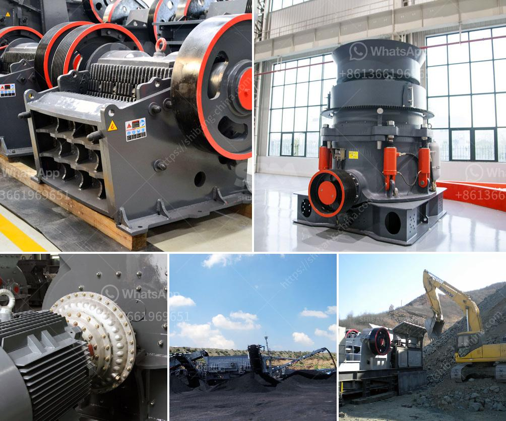

<h3>india conveyor belt for stone crusher</h3>
India is abundant with stone resources that include granite, marble, sandstone, limestone, slate, and quartzite, etc. Stone crushing industry has long history and plays important role in economy development in India. The stone crusher plant in India includes primary jaw crusher, impact crusher, cone crusher, and other auxiliary equipment. The conveyor belt also plays a vital role in giving the efficiency of the unit. They are integral parts of the conveyor system that constantly transfer raw materials from one machine to another.

The India conveyor belt for stone crusher has been widely used in various application areas such as mining industry, building materials, metallurgy, coal industry, and so on. Due to its wide application, it will inevitably generate some noise during the operation, and environmental pollution will also occur if the noise is reached beyond a certain level. A noise is any undesirable audible sound produced by industrial processes. It can be hazardous to the human ear and can cause annoyance, stress, and even hearing loss.

To solve this problem, a lot of manufacturers and users have taken measures to reduce the noise pollution produced by the conveyor belt for stone crusher. In order to provide a quiet working environment, some manufacturers have also adopted advanced noise reduction technology in the design and production of conveyor belts. These technologies include sound insulation, sound absorption, vibration isolation, and sound barriers, etc. By using these technologies, the noise pollution caused by the conveyor belt can be effectively reduced.

In addition, it is also important to choose the right conveyor belt for stone crusher. Different types of conveyor belts have different characteristics, such as high tensile strength, low elongation, excellent impact resistance, and good troughability, etc. The suitability of the conveyor belt for stone crusher should consider the following factors:

- The material properties of the conveyed material, such as bulk density, angle of repose, abrasiveness, etc.

In conclusion, the India conveyor belt for stone crusher has been highly acknowledged as the best choice for stone crushing industry. It prevents the raw materials from being stranded and played a very important role in the smooth operation of the stone crushing industry in India.
<h3>Contact us</h3><ul><li><strong>Whatsapp:&nbsp;<a href="https://wa.me/8613661969651">+8613661969651</a></strong></li><li><a href="https://swt.shibang-china.com/?git&amp;zhl&amp;india conveyor belt for stone crusher"><strong>Online Service(chat now)</strong></a></li></ul><h3>Related</h3><ul><li><a href='used mobile jaw crushers for sale in uae.md'>used mobile jaw crushers for sale in uae</a></li><li><a href='used nd hand coal crusher sizer.md'>used nd hand coal crusher sizer</a></li><li><a href='harare changfa diesel engine.md'>harare changfa diesel engine</a></li><li><a href='drawing for raymond mill.md'>drawing for raymond mill</a></li><li><a href='cement plants suppliers from china.md'>cement plants suppliers from china</a></li></ul>