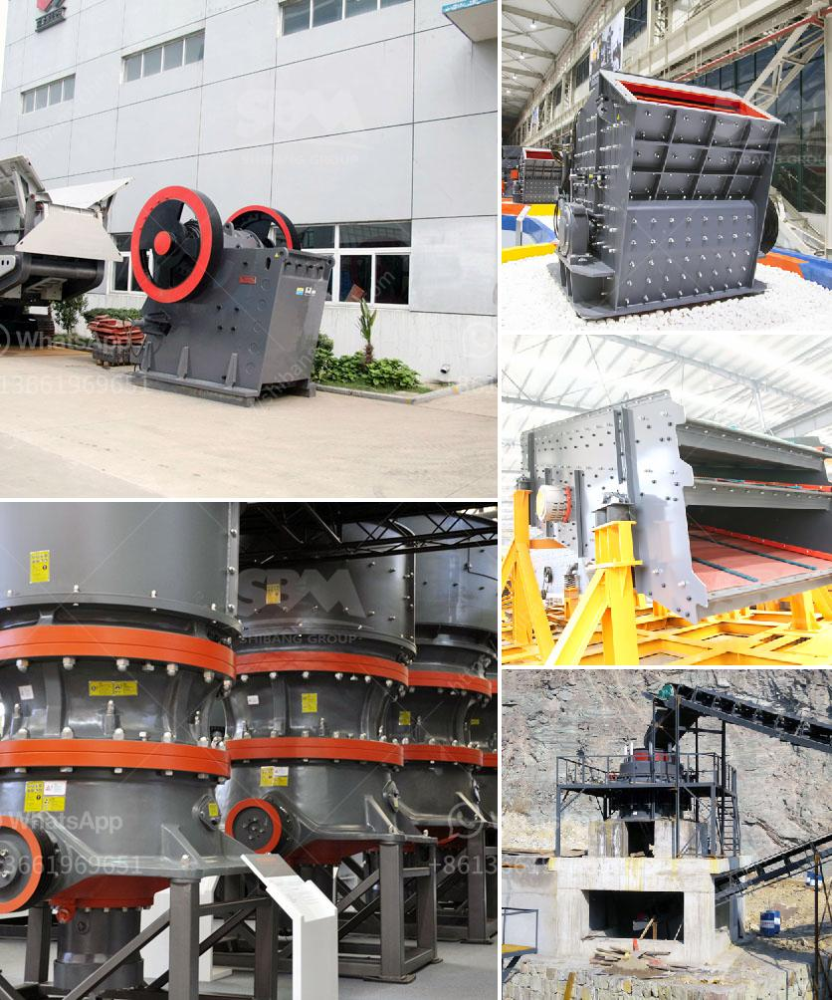

<h3>indonesia ball mill manufacturer</h3>
In the past few decades, Indonesia has been growing steadily as one of the top manufacturing and industrial hubs in Southeast Asia. This expansive country boasts a wealth of resources and skilled workforce, making it an ideal destination for many companies looking to expand their operations.

One sector that has seen significant growth is the manufacturing of machinery and equipment, including ball mills. A ball mill is a cylindrical grinding machine used for grinding various materials, such as ores, chemicals, ceramic raw materials, and paints. 

The ball mill is a key piece of equipment in grinding applications, particularly in mineral processing plants. It is a versatile machine that requires relatively low maintenance and provides consistent performance. The mill operates on the principle of impact and attrition: the size reduction is done by impact as the balls drop from near the top of the shell.

With the increasing demand for high-quality grinding equipment in various industries, the need for reliable ball mill manufacturers also becomes crucial. Fortunately, there are several reputable manufacturers operating in Indonesia that specialize in the production of various types of ball mills.

One such company that has been serving the Indonesian market for a considerable period is PT Tohoma Mandiri. Established in 2005, this company focuses on mining and mineral processing equipment. With years of experience, they have become one of the leading suppliers of ball mills in Indonesia. 

Their success is rooted in their commitment to providing top-quality machinery and exceptional service to their clients. They understand the unique requirements of the Indonesian market and tailor their offerings accordingly. This dedication sets them apart from other manufacturers and makes them the go-to choice for many companies in need of ball mills.

PT Tohoma Mandiri offers a diverse range of ball mills designed to meet various application needs. They have ball mills suitable for wet or dry grinding, batch grinding or continuous grinding, and small-scale or large-scale production. The company ensures that each mill is manufactured using premium-quality materials and advanced manufacturing techniques. 

In addition to providing ball mills, PT Tohoma Mandiri offers comprehensive after-sales support, including installation, maintenance, and repair services. This ensures that their clients can rely on them for all their grinding equipment needs throughout its operational life. 

Indonesia's booming industrial sector requires efficient and reliable grinding solutions, and ball mills play a crucial role in achieving this. The presence of a reputable ball mill manufacturer like PT Tohoma Mandiri is instrumental in providing the necessary equipment to support this growth. 

In conclusion, Indonesia's position as one of the leading industrial hubs in Southeast Asia has created a demand for high-quality grinding equipment. Ball mills are crucial in various industries, and the presence of PT Tohoma Mandiri, a reputable ball mill manufacturer, ensures that the need for reliable grinding solutions is met efficiently. These manufacturers are crucial in supporting industrial growth, as well as contributing to the overall development of the Indonesian economy.
<h3>Contact us</h3><ul><li><strong>Whatsapp:&nbsp;<a href="https://wa.me/8613661969651">+8613661969651</a></strong></li><li><a href="https://swt.shibang-china.com/?git&amp;zhl&amp;indonesia ball mill manufacturer"><strong>Online Service(chat now)</strong></a></li></ul><h3>Related</h3><ul><li><a href='jaw crusher for sale in kenya.md'>jaw crusher for sale in kenya</a></li><li><a href='ball grinding machine manufacturer in india.md'>ball grinding machine manufacturer in india</a></li><li><a href='chaser mills for mica powder.md'>chaser mills for mica powder</a></li><li><a href='stamler usa feeder breaker crusher.md'>stamler usa feeder breaker crusher</a></li><li><a href='used mobile hammer mills for sale.md'>used mobile hammer mills for sale</a></li></ul>