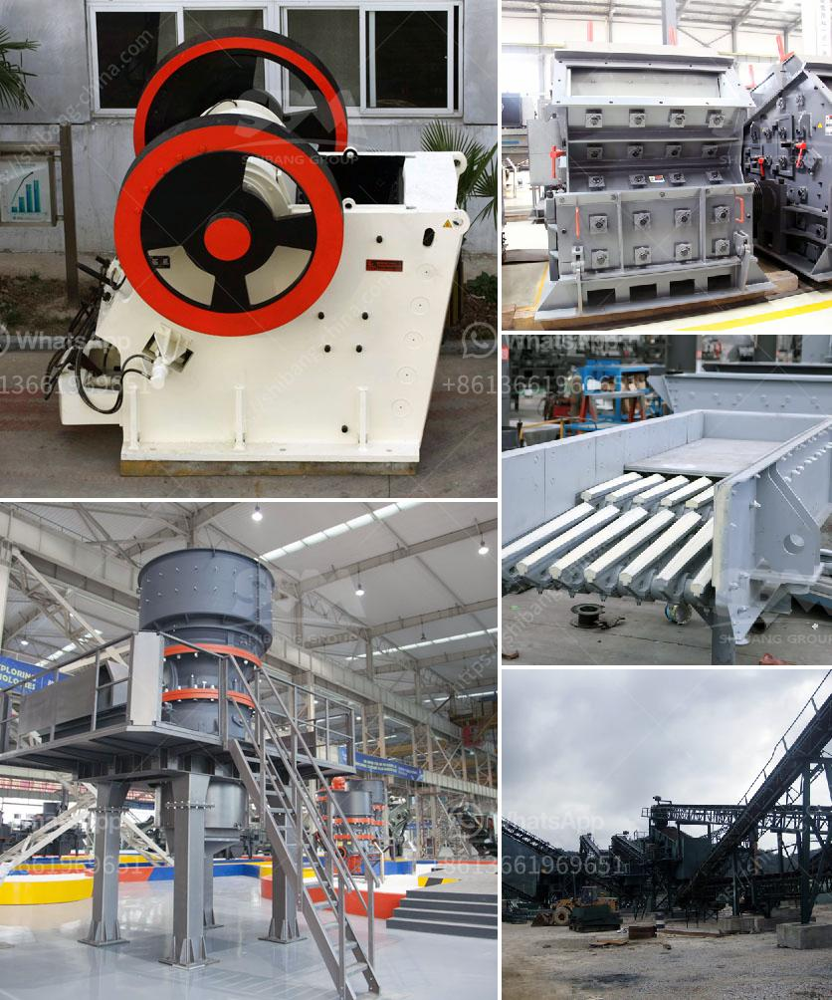

<h3>industr gold mining equipment and prices</h3>
Gold mining is a lucrative industry that has been flourishing for centuries and continues to be a global driver of economic growth. One of the key components of successful gold mining operations is the utilization of advanced equipment and machinery. These tools not only enhance efficiency but also ensure safety for miners, making them essential for extracting and processing this precious metal. In this article, we will explore the various types of industrial gold mining equipment available in the market and their associated prices.

When it comes to gold mining equipment, there is a wide range of machinery that miners can choose from, depending on their specific needs and budget. Starting with the basics, gold pans and sluice boxes are the most inexpensive tools that beginners can use to get started. These simple yet effective tools help separate gold from dirt and gravel through the process of panning. While the prices for gold pans and sluice boxes can vary, they generally range from $10 to $50, making them affordable options for those just starting out in the industry.

Moving up the ladder, gold dredges are another popular piece of equipment among gold miners. These large machines are designed to extract gold from riverbeds and stream deposits by sucking up sediment and processing it for the precious metal. Gold dredges can range in price from a few hundred dollars for smaller models to several thousand dollars for higher-capacity versions. The cost is largely determined by the size, power, and features of the dredge, such as whether it includes a sluice box or a suction nozzle.

For more professional and large-scale gold mining operations, heavy-duty equipment such as trommels, rock crushers, and shaker tables are indispensable. These tools are specifically designed to extract and process gold-bearing ore efficiently and effectively. Trommels, for instance, are cylindrical drum-like machines that separate materials based on their size. They are commonly used to screen out large rocks and debris from the gold-bearing material before further processing takes place. The price range for trommels varies widely depending on their size and capacity, with prices ranging from a few thousand dollars to well over $100,000.

Rock crushers are another crucial machine in the gold mining process. They are used to break down larger rocks into smaller, more manageable sizes, facilitating the extraction of gold particles. Prices for rock crushers can vary greatly based on factors such as size, power, and durability. Typically, prices can range from a few hundred dollars to several thousand dollars.

Lastly, shaker tables are essential for the final step in the gold mining process. These tables vibrate and separate heavy particles, such as gold, from lighter materials. Shaker tables range in price from a few thousand dollars to tens of thousands of dollars, depending on their size, quality, and efficiency.

In conclusion, gold mining equipment is a crucial part of the industry, enabling miners to extract gold more efficiently and safely. The availability and prices of equipment vary depending on the specific needs of the operation, from basic tools like gold pans and sluice boxes to heavy-duty machinery such as dredges, trommels, rock crushers, and shaker tables. It is important for miners to carefully assess their requirements and budget before investing in equipment to ensure optimal productivity and value for money.
<h3>Contact us</h3><ul><li><strong>Whatsapp:&nbsp;<a href="https://wa.me/8613661969651">+8613661969651</a></strong></li><li><a href="https://swt.shibang-china.com/?git&amp;zhl&amp;industr gold mining equipment and prices"><strong>Online Service(chat now)</strong></a></li></ul><h3>Related</h3><ul><li><a href='mobile clusher for hire tanzania.md'>mobile clusher for hire tanzania</a></li><li><a href='washing plant for silica.md'>washing plant for silica</a></li><li><a href='ultrafine vertical roller mill.md'>ultrafine vertical roller mill</a></li><li><a href='100tph jaw crusher.md'>100tph jaw crusher</a></li><li><a href='rock crusher rock crusher.md'>rock crusher rock crusher</a></li></ul>