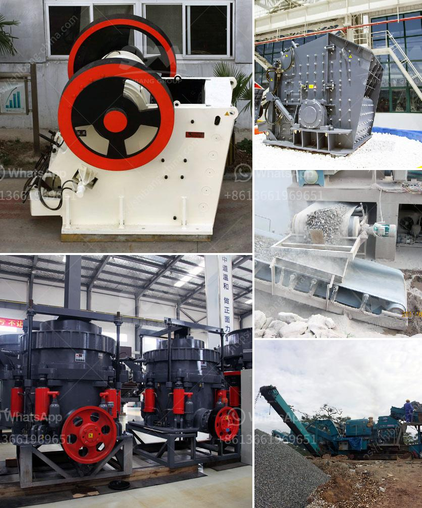

<h3>industrial aluminum can crusher in saudi arabia</h3>
Saudi Arabia, the Kingdom of Saudi Arabia, is a country in the Middle East, located on the Arabian Peninsula. With its vast oil reserves, Saudi Arabia is known as one of the largest oil producers in the world. However, the country also has a growing concern for the environment, particularly in the area of waste management.

As the population of Saudi Arabia continues to increase, so does the amount of waste generated, including aluminum cans. Aluminum cans are widely used for packaging beverages, such as carbonated drinks and juices. These cans, if not properly disposed of, can contribute to environmental pollution and take up a significant amount of space in landfills.

To address this issue, industrial aluminum can crushers have been designed and manufactured in Saudi Arabia. These devices are capable of crushing and compacting aluminum cans of various sizes and shapes. By reducing the volume of aluminum cans, these crushers not only save valuable space in landfills but also make it easier to transport and recycle the crushed cans.

The industrial aluminum can crushers in Saudi Arabia are mainly used by large and medium-sized recycling companies. These crushers are used to break and compact the aluminum cans before recycling them. The crushed cans are then sent for smelting to produce new aluminum products.

One of the main advantages of using an industrial can crusher is that it reduces the cost and effort required to recycle aluminum cans. Crushing and compacting the cans makes them easier to handle and transport. This, in turn, reduces the labor and fuel costs associated with recycling.

In addition, industrial can crushers also contribute to environmental sustainability. By recycling aluminum cans, the demand for raw materials is reduced, which helps conserve natural resources. Moreover, aluminum recycling saves considerable energy compared to producing aluminum from ore. Recycling one ton of aluminum can save up to five tons of bauxite, the ore used to extract aluminum.

Furthermore, the use of industrial aluminum can crushers in Saudi Arabia promotes the concept of sustainable development by reducing pollution and waste. Crusher machines are equipped with a dust suppression system to prevent dust from escaping during the crushing process. This ensures a cleaner and healthier working environment for the operators.

In conclusion, the availability of industrial aluminum can crushers in Saudi Arabia is a positive step towards environmental sustainability. These crushers not only reduce the volume of aluminum cans but also help conserve resources and reduce pollution. As Saudi Arabia continues to develop its waste management infrastructure, the use of can crushers will play a vital role in achieving the country's environmental goals. By promoting recycling and sustainable practices, Saudi Arabia can make a significant contribution to protecting the planet for future generations.
<h3>Contact us</h3><ul><li><strong>Whatsapp:&nbsp;<a href="https://wa.me/8613661969651">+8613661969651</a></strong></li><li><a href="https://swt.shibang-china.com/?git&amp;zhl&amp;industrial aluminum can crusher in saudi arabia"><strong>Online Service(chat now)</strong></a></li></ul><h3>Related</h3><ul><li><a href='sand wash plant hire perth.md'>sand wash plant hire perth</a></li><li><a href='mobile crusher manufacturers.md'>mobile crusher manufacturers</a></li><li><a href='brick crushers south africa.md'>brick crushers south africa</a></li><li><a href='magnetic separator for iron sand.md'>magnetic separator for iron sand</a></li><li><a href='screens hammer mills.md'>screens hammer mills</a></li></ul>