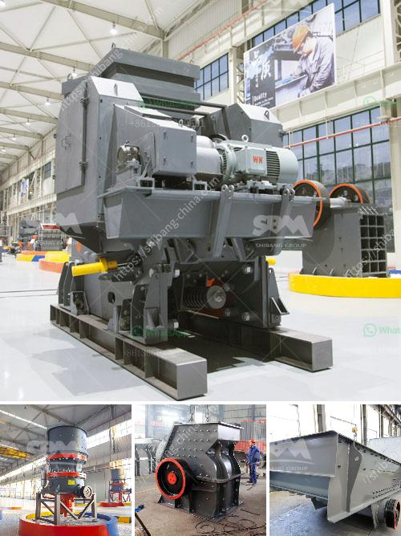

<h3>industrial ball mill for sale</h3>
The industrial ball mill plays a crucial role in the efficient grinding process, as it grinds material into fine powder for further processing. From cement, silicate, fertilizer, ferrous and non-ferrous metals, glass, ceramics, and more, industrial ball mills are indispensable for a wide range of applications.

An industrial ball mill is used for grinding materials in order to achieve the desired composition and consistency. Grinding media (balls, cylpebs, or rods) are added to the mill to assist in the reduction process, which alters the material's mixture by breaking down the particles into finer pieces. The size reduction enhances the material's surface area, making it more reactive or easier to blend or separate.

Industries such as mining, cement, construction, ceramics, and pharmaceuticals rely heavily on industrial ball mills for various stages of material preparation. These mills are designed to handle a wide range of materials, from soft to hard and brittle.

The milling process in an industrial ball mill starts with feeding the material to be ground into the drum, which is then rotated at a high speed. The grinding media inside the drum impact and grind the material, reducing it to the required size.

The critical speed of the ball mill is the speed at which the centrifugal force is equal to the gravity on the inner surface of the mill. The rotation rate of the drum determines the optimal operating speed critical for efficient grinding. When the mill operates below the critical speed, it becomes ineffective, resulting in excessive wear, reduced output, and inefficient energy utilization.

Several factors need to be considered when purchasing an industrial ball mill to ensure the best fit for a specific application:

1. Capacity: Determine the required capacity or throughput for the material to be processed. This will guide the mill's size and power requirements.

2. Material properties: Consider the hardness, composition, and particle size distribution of the material to ensure compatibility with the mill's specifications.

3. Grinding media: Select the appropriate grinding media (balls, cylpebs, or rods) to achieve the desired grind. Different types of media are suited for specific applications.

4. Maintenance requirements: Evaluate the ease of maintenance, such as access to internal components, liner changes, and overall reliability.

5. Price and warranty: Compare prices, warranty periods, and after-sales service to ensure a good investment and reliable support.

Several reputable manufacturers and suppliers offer industrial ball mills for sale, including online platforms and physical stores. It is crucial to research and compare options to select the most suitable and trustworthy provider.

In conclusion, an industrial ball mill is an essential grinding equipment for various stages of material preparation, as it grinds material into fine powder, enhances reactivity, and offers cost-effective solutions for numerous industries. Therefore, considering the factors mentioned above, purchasers can find the perfect industrial ball mill to meet their specific needs and achieve efficient grinding results.
<h3>Contact us</h3><ul><li><strong>Whatsapp:&nbsp;<a href="https://wa.me/8613661969651">+8613661969651</a></strong></li><li><a href="https://swt.shibang-china.com/?git&amp;zhl&amp;industrial ball mill for sale"><strong>Online Service(chat now)</strong></a></li></ul><h3>Related</h3><ul><li><a href='lime stone extraction equipment india.md'>lime stone extraction equipment india</a></li><li><a href='ball mill suppliers in south africa.md'>ball mill suppliers in south africa</a></li><li><a href='quartz making machine germany.md'>quartz making machine germany</a></li><li><a href='cost of mobile coal crusher.md'>cost of mobile coal crusher</a></li><li><a href='bauxite calcination plant cost in india.md'>bauxite calcination plant cost in india</a></li></ul>