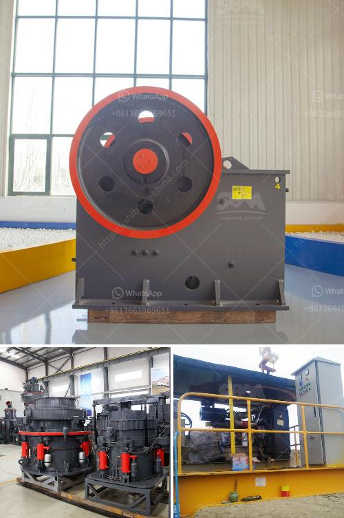

<h3>industrial grinding plant</h3>
Industrial grinding plants play a crucial role in various industries, including mining, cement manufacturing, and chemical processing. These plants are designed to process large quantities of raw materials into desired sizes, making them suitable for further use in production.

One of the primary purposes of industrial grinding plants is to reduce the size of different materials, such as minerals, coal, or ore. This size reduction process is achieved through a combination of crushing and grinding, using specialized equipment and machinery. The raw materials are typically fed into a crusher, which breaks them down into smaller pieces to facilitate the grinding process.

After the initial crushing stage, the smaller pieces are further processed in grinding mills. These mills can vary in size and type, depending on the specific requirements of the industry. Some common types of grinding mills include ball mills, rod mills, and vertical mills. The materials are fed into these mills, where they undergo continuous grinding until they reach the desired fineness.

Industrial grinding plants are significant in the mining industry, where they are used to extract valuable minerals. The grinding process helps in liberating minerals from the ore, allowing for their separation and recovery. This is particularly important for minerals that are embedded within the ore and cannot be easily accessed through conventional methods.

In the cement manufacturing industry, grinding plants are essential for the production of cement. The raw materials, including limestone, clay, and iron ore, are crushed and ground to a fine powder. This powder, known as raw meal, is then heated in a kiln to produce clinker, which is the main component of cement. The grinding process is vital in obtaining the proper fineness of the raw meal, ensuring the quality and strength of the final cement product.

The chemical processing industry also relies on industrial grinding plants for a variety of applications. The grinding process is used to produce powders or granules of chemicals, allowing for better solubility and dispersibility. Additionally, grinding can be performed to mix different chemicals together, creating customized blends for specific industrial applications.

Industrial grinding plants are highly efficient and can process large volumes of materials in a short period. This allows industries to meet their production demands and increase their overall productivity. Furthermore, these plants are designed to be energy-efficient, minimizing energy consumption while maximizing output.

In conclusion, industrial grinding plants play a vital role in various industries, providing the necessary size reduction and processing capabilities. They are essential for mining, cement manufacturing, and chemical processing, allowing industries to extract valuable materials, produce high-quality cement, and create customized chemical blends. With their efficiency and energy-saving features, these plants contribute significantly to the overall productivity and sustainability of industrial processes.
<h3>Contact us</h3><ul><li><strong>Whatsapp:&nbsp;<a href="https://wa.me/8613661969651">+8613661969651</a></strong></li><li><a href="https://swt.shibang-china.com/?git&amp;zhl&amp;industrial grinding plant"><strong>Online Service(chat now)</strong></a></li></ul><h3>Related</h3><ul><li><a href='crushing machine for chromium and chromite ore.md'>crushing machine for chromium and chromite ore</a></li><li><a href='crusher machine philippine price.md'>crusher machine philippine price</a></li><li><a href='price of grinding machine.md'>price of grinding machine</a></li><li><a href='hammer mill peru.md'>hammer mill peru</a></li><li><a href='secondary impact crusher.md'>secondary impact crusher</a></li></ul>